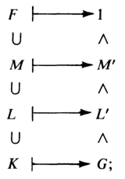

# 伽罗瓦理论

- **符号约定**：
  - $\sigma$ 表示伽罗瓦映射

## 基本概念

- **$F$ 在 $K$ 上的伽罗瓦群**：$F$ 关于 $K$ 的域自同构群 $\aut_K F$
  - **无交换性**：
    - **反例**：数乘自同构和加法自同构之间不可交换
- **关系定理**：设 $K\leq E\leq F$，则 $\aut_K F/\aut_E F$ 同构于 $\aut_K E$ 的子群
  - **证明**：
    - 取限制映射 $\rho: \aut_K F\to \aut_K E，\sigma\mapsto \sigma|_E$
      - 易得 $\ker\rho = \aut_E F$，$\Im\rho \leq \aut_K E$
    - 由同态基本定理即得结论
  - 仅当 $F\geq K$ 是有限伽罗瓦扩张时才取等
- **（定理2.2）伽罗瓦群保根性**：
  - 设 $F\geq K，f\in K[x]$，$u\in F$ 是 $f$ 的根
  - 则 $\forall \sigma\in\aut_K F$，$\sigma(u)\in F$ 也是 $f$ 的根
  - **证明**：
    - 和根的同构传递性类似，$0 =\sigma(f(u)) = \sum k_i\sigma(u)^i = f(\sigma(u))$
  - **本质**：
    - 伽罗瓦群本质是保持基域元素不动的根置换群
    - 伽罗瓦群的元素 $\sigma$ 完全由其在基上的作用决定
- **根扩张定理**：
    - 设 $m$ 是 $f$ 在 $K(u)$ 上的根数，则 $|\aut_K K(u)|\leq m$
      - 因为
  - **实例**：
    - **平凡伽罗瓦群**：$F = K$ 时，$\aut_K F = 1$
      - $\aut_\Q\  \Q(\sqrt[3]{2}) = 1$
      - $\aut_\Q\R = 1$
    - $\aut_\R \C \cong \Z_2\cong \aut_\Q \ \Q(\sqrt{3})$（恒等映射）（原基不变、新基取反的映射）
    - $F = \Q(\sqrt{2},\sqrt{3})$
      - $\set{1,\sqrt{2},\sqrt{3},\sqrt{6}}$ 是 $F$ 在 $\Q$ 上的基
      - $\aut_\Q F \cong \Z_2\oplus\Z_3$

### 固定域和稳定子群

- **伽罗瓦群的可动点**：设 $a\in F$，若存在 $K$ 自同构 $\sigma$ 满足 $\sigma(a) \neq a$，则 $a$ 称为 $\Aut_K F$ 的可动点
- **非稳定 $K$ 自同构**：
  - 设域 $K\leq E\leq F$，$\sigma\in \aut_K F$
  - 若存在点 $a\in E$ 满足 $\sigma(a) \neq a$，则 $\sigma$ 称为 $E$ 的非稳定 $K$ 自同构
- **（定理2.3）对应定理**：
  - 设域 $K\leq E\leq F$，群 $H\leq \aut_K F$
  - 则
    - **固定域**：$H' = \hkh{v\in F\Bigm| \forall \sigma\in H，\sigma(v) = v}$ 是中间域
      - $\aut_K F$ 的子群 $H$ 的不动点集，其外均为K自同构的可动点
      - **对应性**：$H = \aut_{H'} F$
      - **证明**：
        - 域同构可定义加减乘除为像的加减乘除，易得运算封闭
        - 由于 $H$ 是K自同构，故 $K$ 均为 $H$ 不动点，$K\leq H'$
        - 再由 $H'$ 定义在 $F$ 中，即得是中间域
    - **稳定子群**：$E' = \hkh{\sigma \in \aut_K F\Bigm | \forall u\in E，\sigma(u) = u}$ 是伽罗瓦子群
      - $\aut_K F$ 作用在 $E$ 上时的稳定子群，其外均为E的非稳定K自同构
      - **对应性**：$E' = \aut_E F$
      - **证明**：
        - 易得是群，再由取样分析法得是子群
  - **本质**：
    - 每个中间域 $E$ 都对应一个伽罗瓦子群 $\aut_E F$
    - 伽罗瓦群的每个子群 $H = \aut_{H'}F$ 都对应一个中间域 $E$

### 伽罗瓦扩张

- **伽罗瓦扩张**：
  - **整体定义法**：设域 $F\geq K$，若 $(\aut_K F)' = K$，则 $F$ 称为伽罗瓦扩张
  - **元素定义法**：$\forall u\in F\j K，\exists \sigma\in \aut_K F$ 满足 $\sigma(u)\neq u$
    - 最不稳定的扩张（只有 $K$ 不动），最自由的扩张
  - **固定域定义法**：任意域都是其固定域的伽罗瓦扩张
    - 显然伽罗瓦扩张是不唯一的，即使同一维数也不唯一
<!-- - **收缩定理**：设 $\aut_K F$ 的固定域为 $K_0$，则 $\aut_K F = \aut_{K_0}F$
  - 其实在前面已经写过了
  - **证明**：
    - 由 $K_0\geq K$，保持 $K_0$ 不变的自同构一定也保持 $K$ 不变，故 $\aut_{K_0} F\subset \aut_K F$
    - 由固定域定义，$K_0$ 是所有 $K$ 同构的不动点，故 $\aut_K F \subset \aut_{K_0} F$ -->
- **无限域的伽罗瓦扩张定理**：设 $K$ 是无限域，则 $K(x)$ 是 $K$ 的伽罗瓦扩张
  - **证明**：
    - 首先，$K(x)\geq K$，故 $\aut_{K(x)} F\leq \aut_K F$
    - 若 $K$ 是不动点，则有理分式 $K(x)$ 当然也是不动点。故 $\aut_K F\leq \aut_{K(x)} F$
    - 即 $K$ 是 $K(x)$ 的固定域，从而是伽罗瓦扩张
  - **实例**:
    - $\C = \R(i)$ 是 $\R$ 的伽罗瓦扩张
      - **证明**：
        - 反设 $\C\j\R$ 上有不动点 $a+bi$
        - 则对 $\forall \sigma\in \aut_\R \C$，有 $\sigma(a+bi) = a + b\sigma(i) = a+bi$，即 $\sigma(i) = i$，只能是恒等映射
    - $\Q(\sqrt{d})$（$d\in \Q$ 非负）是 $\Q$ 的伽罗瓦扩张
      - **证明**：
        - 反设有不动点 $a + b\sqrt{d}$，同上即可得结论

## 基本伽罗瓦理论

- **相对维数**：中间域 $L\leq M$ 中，$[M:L]$ 称为它们的相对维数
- **相对指数**：伽罗瓦群 $H\leq J$ 中，$[J:H]$ 称为它们的相对指数
- **理解**：
  - $[M:L]$ 的意义是规定了基所考虑的范围。$M$ 规定了上界，$L$ 规定了下界
    - 因为所有 $L$ 以内元素都可以被幺元 $1$ 表出，故都等价于 $1$
    - 而 $M$ 外的元素不予考虑
    - 所以最终需要考虑的只有 $M\j L$ 的基
  - $[L':M']$ 的意义是规定了同构所考虑的范围。$L'$ 规定了上界，$M'$ 规定了下界。
    - 因为任意同构复合一个 $M'$ 中元素后，都可以在保持 $M$ 内元素不变的情况下，变成另一个任意同构。也就是说，若两个同构在 $M$ 上作用相同，则它们在 $M'$ 陪集下等价。故考虑 $[L':M']$ 的元素时，只需要考虑其在 $M$ 内元素上的作用即可
    - 而 $L'$ 则规定我们考虑的任意同构都必须在 $L$ 上是恒等映射
    - 所以最终需要考虑的只有同构在 $M-L$ 上的作用
  - 以后将伽罗瓦群 $\aut_L M$ 中的下标 $L$ 称为**下界**，$M$ 称为**上界**

### 反序对应性

- **反序对应链**：设域 $F\geq K$，伽罗瓦群 $G = \aut_K F$，则下图的对应关系称为反序对应链
   $\whhh$ 
  - 此时称 $[M:L]$ 和 $[L':M']$ 为反序对应关系，上面图片中的两个扩张链和其反序对应关系称为反序对应链
- **（定理2.5）基本伽罗瓦理论**：设 $F$ 是 $K$ 的有限维伽罗瓦扩张，则存在中间域族和伽罗瓦子群族的双射，满足下列性质：
  - **指数对应性**：任两个中间域的相对维数和对应两个子群的相对指数对应相等
    - 反序对应链均取等
    - **证明思路**：
      - 由闭对应性定理，存在闭域和闭子群的双射
      - 再由维度反序收敛条件，有限维伽罗瓦扩张的所有中间域和子群都是闭的，故总存在双射，且相对指数/维数相等
  - **全闭性**：$F$ 是所有中间域的伽罗瓦扩张
    - 中间域都是闭域
    - **证明思路**：
  - **伽罗瓦正规性**：中间域 $E$ 是 $K$ 的伽罗瓦扩张 $\LR E' = \aut_E F\lhd G = \aut_K F$
    - **证明思路**：
      - **必要性**：
        - 由于中间域都是有限维的，故均是代数扩张
        - 若再是伽罗瓦扩张，则是稳定中间域，从而是正规子群
      - **充分性**：
        - 若 $E'\lhd \aut_K F$，由稳定正规性得 $E''$ 是稳定中间域
        - 再由 $E$ 是闭域，得 $E = E''$，从而由稳定中间域的伽罗瓦传递性，即得 $E$ 也是伽罗瓦扩张。
    - **推论**：$G/E'$ 同构于 $\aut_K E$
  - **本质**：（有限维伽罗瓦扩张）的（反序对应链）具有三个良好的对应性质
