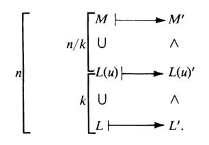

# 伽罗瓦理论的证明1

- **符号约定**：
  - $K\leq F$，其它都是中间域
  - $G = \aut_K F$，其它都是伽罗瓦子群
  - 默认扩张都是有限维

## 闭性

- **闭中间域【闭伽罗瓦子群】**：
  - **闭包定义法**：设 $X$ 是中间域【伽罗瓦子群】，若 $X = X''$，则 $X$ 是闭的
    - $X''$ 就是 $X$ 的闭包，它关于不动元封闭
      - 当 $X$ 是中间域时，$X''$ 是 $\aut_X F$ 的不动点集。即闭域是包含自身全部不动点的域
      - 当 $X$ 是伽罗瓦子群时，$X''$ 是 $X'$ 的稳定子群，即闭伽罗瓦子群是包含自身全部稳定子的群
    - 闭性依赖于扩张关系 $K\leq F$。改变 $K$ 或 $F$ 时，闭性也会变
- **伽罗瓦扩张的闭性**：$F$ 是 $K$ 的伽罗瓦扩张 $\LR K$ 是固定域的子域 $\LR K$ 是闭中间域
  - **证明**：
    - 由反序关系引理（3）直得结论
  - 反序对应链的两端 $K,F$ 一定是闭的

## 对应关系

- **（引理2.6）反序关系引理**：
  - 设 $L,M$ 是中间域，$H,J$ 是伽罗瓦子群
  - 则
    - **端点关系**：$\begin{cases} F' = 1，K' = G & 稳定子群 \\\\ G' = K，1' = F & 固定域 \end{cases}$
      - 定义易得
    - **反序关系**：$\begin{cases} L\leq M\red\Rt M'\leq L' & 中间域 \\\\ H\leq J \red\Rt J'\leq H' & 伽罗瓦子群 \end{cases}$
      - 定义易得
    - **二阶关系**：$L\leq L''，H\leq H''$。若 $F$ 是伽罗瓦扩张，则取等
      - 定义易得
    - **三阶关系**：$L' = L'''，H' = H'''$ 
      - 用上面几个结论，互包证明即可
- **（定理2.7）闭对应性**：任意闭中间域族和闭伽罗瓦子群族，都存在一一对应
  - **证明**：
    - **固定映射**：$E\mapsto E'$
    - **双射性**：由闭域定义，$(E')' = E'' = E$，故是双射
  - **证明（笨方法）**：
    - 设 $E$ 是闭中间域，则由闭域等价性得 $F$ 是 $E$ 的伽罗瓦扩张，从而 $F\j E$ 的元素均对于E自同构可动
    - **单射性**：反设不是单射，即存在两个闭域 $E_1>E_2$，但 $E_1' = E_2'$
      - 此时使 $E_2$ 不动的自同构也必定使 $E_1$ 不动（我知道这并不是定义的等价叙述，但只要选取其中有用的部分就行了）
      - 则 $\forall a\in E_1-E_2$
        - 由 $E_1$ 是闭的，得 $a$ 在 $E_1$ 自同构下均不动
        - 由 $E_2$ 是闭的，得 $a$ 在 $E_2$ 自同构下可动，矛盾
    - **满射性**：由伽罗瓦稳定子群的定义即可
    - 好吧，我实际上把反序关系引理又证了一遍

## 维数对应关系

- **（引理2.8）域的维度反序单不增性**：
  - 设域 $K\leq L\leq M\leq F$
  - 若 $[M:L]$ 有限，则 $[L':M'] \leq [M:L]$
  - **证明（维数归纳法）**：
    - 当 $[M:L] = 1$ 时，$M=L$，结论显然成立
    - 当 $[M:L] = n$ 时
      - 取 $u\in M\j L$，由有限结构定理，$M\geq L$ 是代数扩张，故 $u$ 为代数元素，设其最小多项式 $f\in L[x]$ 的次数为 $k$
        - 则此时 $[L(u):L] = \deg f = k$，则 $[M:L(u)] = \dfrac{n}{k}$
        
      - 若 $k<n$
        - **降维**：由归纳假设，$[L':L(u)'] \leq k，[L(u)':M'] \leq \dfrac{n}{k}$，从而 $[L':M'] \leq n = [M:L]$
      - 若 $k=n$
        - **降维**：此时 $M = L(u)$
        - 此时 $M$ 是 $f$ 根的扩域
        - 扩群的指数是陪集数量，扩域的指数是根的数量
        - 只需构造（$[L':M']$ 的左陪集 $S$）到（$f$ 的根集合 $T$）的单射，即可得到数量关系
        - 设 $\tau M'\pad (\tau\in L')$ 是左陪集元素，考虑 $\p:S\to T，\tau M'\mapsto \tau(u)$
        - **存在性**：
          - 若 $\sigma\in M'$，则由 $u\in M$ 得 $\tau\sigma(u) = \tau(u)$
          - 设 $u$ 是 $f\in L[x]$ 的根，由 $\tau$ 在 $L$ 上不动得 $\tau(u)$ 也是 $f$ 的根。即 $\tau(u)\in T$
        - **单射性**：
          - 反设其不是单射，则存在 $\tau(u) = \tau_0(u)$，则 $\tau_0^{-1}\tau$ 以 $u$ 为不动点，从而 $L(u) = M$ 是其不动点集，即 $\tau_0^{-1}\tau\in M'$，从而两映射在陪集下等价。故 $\p$ 是单射
  - **理解**：
    - 有限维扩张是代数扩张，从而由归纳法化简为单扩张情况
    - 当 $M > L(u)$ 时，可以直接降维
    - 当 $M = L(u)$ 时，基的数量转化为多项式根的数量，从而由同构保根性易得结论
      - 对每一个L同构映射 $\tau$，都可找到 $L(u)$ 的根 $u$ 在其下的像 $\tau(u)$。也就是说，同构等价类（陪集 $\{\tau M'\mid \tau\in L'\}$）的数量不多于元素等价类的数量（基的数量/多项式的根数 $\{\tau(u)\mid \tau\in L'\}$）
  - **本质**：
    - 对任意多项式，保根同构的数量不多于根的数量
    - 若保根同构的数量比根的数量还多，而某个根 $u$ 在这些同构下的所有像都是根，则根的数量多于 $\deg f$，这不可能
    <!-- - 这一点在后面的[稳定中间域](#域稳定性)中会更加明朗 -->
  - **推论**：若 $[F:K]$ 有限，则 $|\aut_K F| = |K'| = [K':F'] \leq [F:K]$
- **（引理2.9）群的维度反序单不增性**：
  - 设伽罗瓦群 $H\leq J\leq \aut_K F$
  - 若 $[J:H]$ 有限，则 $[H':J'] \leq [J:H]$
  - **证明**：
    - 反设 $[J:H] = n，[H':J'] > n$，则存在线性无关集 $\{u_1,...,u_{n+1}\}\in H'$
    - 设 $\{\tau_i\}^n_{i=1}$ 是 $[J:H]$ 的左陪集代表元系，<!--则其满足 $\begin{cases} J = \mathop{\bigcup}\limits^n_{i=1} \tau_iH \\ \tau^{-1}_i\tau_j\in H \LR i=j \end{cases}$ -->
    - 取 $n$ 个 $n+1$ 未知数的线性方程 $\sum\limits^{n+1}_{j=1} \tau_i(u_j)x_j = 0\pad (1\leq i\leq n，x_j\in F)$。由系数矩阵形状得存在非平凡解空间，不妨设某个维数最小解为 $\bs x = (1_F,...,a_r,0,...,0)$
    - 如果 $\exists \sigma\in J$ 使得 $\sigma \bs x$ 是不同的解，则此时取 $\bs x-\sigma \bs x$ 依然为解，但只有 $r-1$ 个非零元，与维数最小性矛盾。故只能是 $[H':J']\leq n$（也就是无解或仅零解）
      - **不同性**：$x$ 不是所有 $\sigma$ 的不动点
        - 由陪集定义，此时必有一个 $\tau_i\in H$，不妨设为 $\tau_1$。由 $u_i\in H'$，所有 $u_i$ 都是其不动点，则代入得此时有 $\sum\limits^r_{i=1} u_ia_i = 0$。再由 $u_i$ 在 $J'$ 中线性无关且 $a_i$ 非零，只能是 $\exists a_i\notin J'$，不妨设为 $a_2$。此时 $\sigma a_2 \neq a_2$
      - **解性**：用 $\sigma$ 作用于原方程组是同解的
        - $\forall \sigma\in J$，由群论易得 $\{\sigma\tau_i\}^n_{i=1}$ 也是 $[J:H]$ 左陪集代表元系
          - 因此，$\sigma$ 是对 $\{\tau_i\}$ 的置换。即对任意 $\sigma\tau_k$，都有 $\tau_{i_k}$ 和其在一个陪集中
          - 若 $\zeta,\t$ 在同个 $[J:H]$ 的陪集 $\sigma\tau_i H$ 中，则由 $u_j$ 均是 $H$ 的不动点得 $\zeta(u_j) = \sigma\tau_i(u_j) = \t(u_j)$
        - 综上，$\sigma$ 作用于原方程组后，原系数 $\tau_i(u_j)$ 均不变，新方程组是同解变换（**证毕**）
  - **理解**：利用非零式构造线性方程组。横向是作用数量，纵向是基数量。通过矩阵形状与秩和解的关系发现结论
    - 由线性无关性，取 $H'-J'$ 中基的非零式只能是仅零解。再由于 $J$ 中同构都是同解变换，故线性方程组的行数（非零式在作用下像的数量）（非零式上作用的数量）（由基的表出性，或者说基是 $H'-J'$ 元素的等价类，该数量等于 $J$ 中同构在 $H'-J'$ 上作用的数量，也就是 $[J:H]$ 的值）必须不小于 $[H':J']$（基的数量）（线性方程组的列数），否则存在横向长条的系数矩阵，其必有非零解。
  - **本质**：
    - 对任意多项式，基的数量不多于保根同构的数量
    - 若基的数量比保根同构（可看作基的置换）数量还多，则由高代知识，存在一组非零系数 $(x-\sigma x)\in J'$，使得基的线性组合为0，即基线性相关。显然这不可能。

## 终极结论

- **（引理2.10）维度反序收敛条件**：
  - 设域 $K\leq L \leq M\leq F$，伽罗瓦群 $H\leq J\leq \aut_K F$
  - 若 $L$ 是闭的，$[M:L]$ 有限，则 $M$ 也是闭的，$[L':M'] = [M:L]$
    - 闭域的有限维扩张是闭的，且反序维度不变
    - **证明**：同下
  - 若 $H$ 是闭的，$[J:H]$ 有限，则 $J$ 也是闭的，$[H':J'] = [J:H]$
    - 闭群的有限维扩张是闭的，且反序维度不变
    - **证明**：$[J:H]\leq [J'':H] = [J'':H''] \leq [H':J']\leq [J:H]$
  - 若 $F$ 是 $K$ 的有限维伽罗瓦扩张，则所有中间域和伽罗瓦子群都是闭的，也即 $|\aut_K F| = [F:K]$
    - **证明**：
      - 由伽罗瓦扩张的闭性，$K$ 是闭域。再由中间域都是有限扩张，得中间域都是闭的。
      - 由于 $F' = \lang 1 \rang$ 是闭的，故由遗传性，$\aut_K F$ 的有限伽罗瓦子群均是闭的
  - **本质**：闭域的定义就是为了反序维度相等服务的。故这个结论是显然易证的
  - **总结**：
    - 一般的扩张中，只有在闭域/闭群上反序链维度值不变，其余情况均减小。故最终到达 $F$ 时会收敛到某个值
    - 而伽罗瓦扩张中，反序链的维度始终保持不变，也就是说，所有域/群都是闭的
