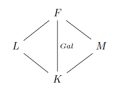

# 伽罗瓦理论的证明2

- **思路**：
  - 正规子群是研究群的有力工具，故我们希望找到伽罗瓦正规子群在中间域的对应
  - 由此定义出的域就是稳定中间域

## 稳定中间域

- **稳定中间域**：设域 $K\leq E\leq F$，若 $\aut_K F\big|_E = \aut_K E$，则 $E$ 称为稳定中间域
  - 任意K自同构中，E内的点和E外的点无关
  - 之前讨论的伽罗瓦子群都是将下界 $K$ 改为 $E$，现在则换成了将上界 $F$ 改为 $E$
  - 本节的目的是：对于一个给定的域 $K$，将其所有伽罗瓦扩张按维度大小来分出层次
  - **逆映射传递性**：$\forall \sigma\in \aut_K F，\sigma^{-1} \in \aut_K E$
    - **证明**：由同构可逆性，$\forall \sigma^{-1}\in \aut_K F$，由 $E$ 定义即得其也为 $E$ 自同构
- **（引理2.11）稳定正规性**：
  - 若 $E$ 是稳定中间域，则 $E' = \aut_E F\lhd \aut_K F$
    - **证明**：
      - 任取 $u\in E，\sigma\in \aut_K F$
      - 由 $E$ 稳定得 $\sigma(u)\in E$，从而 $\forall \tau\in E'，\tau\sigma(u) = \sigma(u)$，从而 $\sigma^{-1}\tau\sigma(u) = u$
      - 再由任意性即得正规性
  - 若 $H\lhd \aut_K F$，则 $H'$ 是稳定中间域
    - **证明**：
      - 任取 $\sigma\in \aut_K F，\tau\in H$
      - 由正规性，$\sigma\tau^{-1}\sigma\in H$，从而 $\forall u\in H'，\sigma(u)$ 是所有 $\tau$ 的不动点，从而 $\sigma(u)\in H'$
      - 再由任意性即得稳定性
  - **理解**：
    - 已知正规子群 $N$ 在共轭轨道中稳定，即 $N$ 中元素的共轭轨道必定全部位于 $N$ 中
    - 而稳定中间域 $E$ 在K自同构轨道中稳定，即 $E$ 中元素的K自同构轨道必定全部位于 $E$ 中
    - 故稳定中间域的K自同构群是伽罗瓦群的正规子群

### 稳定中间域的伽罗瓦扩张性

- **（引理2.12）伽罗瓦扩张的遗传条件**：
  - 设域 $F\geq K$ 是伽罗瓦扩张，$E$ 是稳定中间域，则 $E\geq K$ 也是伽罗瓦扩张
  - **证明**：
    - 设 $u\in E\j K$，则由伽罗瓦扩张的可动性，存在 $\sigma\in \aut_K F$ 满足 $\sigma(u)\neq u$
    - 再由稳定性，$\sigma|_E\in \aut_K E$，从而 $E$ 也是伽罗瓦扩张
  - **理解**：
    - 当上界 $F$ 给定时，伽罗瓦扩张只会随下界 $K$ 变化而变化。因此将考虑范围由 $F$ 变为 $E$ 时，上下界均不变，故伽罗瓦性不变
    - 稳定中间域只是保证取限制后依然是伽罗瓦群而已，类似商群必须商去正规子群
- **（引理2.13）伽罗瓦扩张的稳定条件**：
  - 设域 $F\geq K$，若中间域 $E$ 同时是代数扩张和伽罗瓦扩张，则其稳定
  - 代数扩张 + 伽罗瓦扩张 = 可分的分裂域 $\subset$ 稳定中间域
  - **证明**：
    - 设 $u\in E$，其最小既约多项式为 $f\in K[x]$，在 $E$ 中的所有根为 $\{u_1,...,u_r\}$。则由代数扩张结构公式，$r\leq n = \deg f$
  - **可分性 + 分裂性**：
    - 设 $g(x) = \prod\limits^r_{i=1} (x-u_i)\in E[x]$。易得其系数均为根 $u_i$ 的对称式。再由K同构是根的置换，即得 $g(x)$ 的系数都是 $\aut_K E$ 的不动点
      - 再由 $E$ 是伽罗瓦扩张，故不动点只能在 $K$ 内，从而 $g\in K[x]$
      - 由 $u_i$ 均是 $g$ 的根，而 $f$ 是最小既约多项式，故 $f\mid g$
      - 再由于 $\{u_r\}$ 是 $g$ 全部的根，但不一定是 $f$ 全部的根，故 $\deg g\leq \deg f$
      - 综上得只能是 $f = g$（即 $E$ 是 $f$ 的可分的分裂域）
  - **稳定中间域**：
    - 由 $g$ 定义即得 $f$ 的根均在 $E$ 中
      - 任取 $\sigma\in \aut_K F$，由K同构保根性，$\sigma(u_i)$ 也是 $f$ 的根，从而 $\sigma(u_i)\in E$
      - 再由于代数扩张中，$\{1_K,u_i,...,u_i^{n-1}\}$ 是基，故对任意 $E$ 中元素也成立 $\sigma(u) \in E$，从而 $E$ 是稳定中间域。
  - **理解**：代数扩张的基由某个最小多项式 $f$ 的根集组成，故可转化为讨论 $f$ 根集的稳定性
    - 巧妙地取一个在 $E$ 中分裂的对称多项式 $g$，其在根置换下不动。而题设中的伽罗瓦扩张将置换的不动区域限定在 $K$ 中，从而 $g$ 在 $K[x]$ 中，即 $K$ 中有一个在 $E$ 中分裂的多项式。再证明 $g$ 在 $K[x]$ 中最小既约，则 $E$ 就是 $K$ 中 $f$ 的的分裂域
    - 而分裂域中包含全部的根，即包含代数扩张的全部基。当然对于根置换是稳定的
  - **反例（若无代数扩张性，则不成立）**：
    - 设 $K$ 是无限域，则 $K(x,y) \geq K$ 的中间域 $K(x)$ 是伽罗瓦扩张，但不稳定
      - **证明**：伽罗瓦性由习题得到，不稳定性由自同构 $\sigma:x\mapsto y$ 得到
- **稳定伽罗瓦定理**：设 $F$ 是有限维扩张，则 $E$ 是稳定中间域 $\LR E$ 是伽罗瓦扩张
  - **证明**：上面两个引理可分别推出充分和必要性
    <!-- - 设 $[E:K] = n$，基为 $u_1,...,u_n$
    - **必要性**：由于 $[K':E']\leq [E:K]$，设 $\tau_i\in K'$ 是 $E$ 的陪集代表元系，构造线性方程组 $\sum\limits^n_{j=1} \tau_i(u_j)x_j = 0(x_j\in E)$
      - 再由稳定中间域定义，$\forall \tau_i(u_j)\in E$，依然是基。此时线性方程组只能是零解或无解，。也就是说，至少有 $n$ 个不同的 $\tau_i$，也即 $[K':E'] = [E:K]$，即 $E,K$ 都是闭域，从而 $E$ 是伽罗瓦扩张
    - **充分性**：思路同上，逆推即可-->
  <!-- - **本质**：和群的维度倒向单不增关系证明不同的是，$a_j$ 不能超出 $E$，此时可得更强的结论  -->

### 稳定中间域的可延拓性（中间域K同构的可延拓条件）

- **可延拓K同态**：
  - 设域 $K\leq E\leq F$，$\tau\in \aut_K E$
  - 若存在 $\sigma\in \aut_K F$ 使得 $\sigma|_E = \tau$，则称 $\tau$ 关于 $F$ 可延拓
- **（引理2.14）稳定中间域的可延拓性**：
  - 设域 $F\geq K$，$E$ 是稳定中间域
  - 则商群 $\aut_K F/\aut_E F$ 同构于（$\aut_K E$ 中所有关于 $F$ 可延拓的元素）
  - **证明**：
    - 由 $E$ 稳定性，易得**取限制映射** $\p:\aut_K F\to \aut_K E，\sigma\mapsto \sigma|_E$ 是群同态，其像是关于 $F$ 可延拓的K自同构所组成的子群
    - 易得其核为 $\aut_E F$，由第一同构定理，可得规范群同态是同构
  - **理解**：
    - 在 $E$ 上恒等的K同构（即 $\aut_E F$）在延拓到 $F$ 上时是等价的，故要将其商去，也就是取规范群同态
    <!-- - $\aut_K F$ 实际上都对应一个可延拓映射，但彼此可能等价 -->
    - 若 $E$ 不是稳定中间域，则可能 $\sigma$ 取限制后不再是同构，此时 $\p$ 不是良定义的
  - **本质**：
- **（引理2.15）Artin**：
  - 设 $F$ 是域，$G = \Aut F，K = G'$
  - 则 $F$ 是 $K = (\Aut F)'$ 的伽罗瓦扩张
    - **证明**：
      - $K$ 是所有F自同构的不动点，显然其必定小于 $F$，故可设 $u\in F-K$
      - 由 $K = (\Aut F)'$，其外元素均可动，故存在 $\sigma\in G$ 满足 $\sigma(u)\neq u$。由 $u$ 任意性，得只有 $K$ 是 $\aut_K F$ 的固定域，从而 $F$ 是伽罗瓦扩张
    - **理解**：可将 $\Aut F$ 看作 $\aut_{1} F$，这样问题本质就变成了已经证明的结论（任意扩张域 $F\geq 1$ 对于其固定域 $K$ 都是伽罗瓦扩张）
  - 若 $G$ 是有限群，则 $F$ 是 $K$ 的有限维伽罗瓦扩张，伽罗瓦群为 $G$
    - **证明**：
      - 此时 $[F:K] = [1':G'] \leq [G:1] = |G|$，从而 $F$ 是有限维扩张
      - 再由于 $F$ 为伽罗瓦扩张，得 $G$ 是闭域。即 $\aut_K F = K' = G'' = G$
    - **理解**：
  - **本质**：
    - 倒向对应链在两端上的特例
    - 这里实际上是讨论了（自同构群固定域）的伽罗瓦扩张性，这是一种新的伽罗瓦对应视角（在Milne书中的定义）。但Hungerford不详细讨论
    - 维度倒向对应关系
      - 域：$[F:(\Aut F)'] \leq [\Aut F:1] = |\Aut F|$
      - 群：$|\aut_{F_0} F| = [\aut_{F_0} F:1] \leq [F:(\Aut F)']$

## 习题

### 分式域的伽罗瓦扩张

- **域上环自同态**：$\p:F\to F$ 均为单同态，且保幺元
- **分式伽罗瓦扩张引理**：
  - **最小超越引理**：
    - 设 $f/g\in K(x)\j K$
    - 则
      - $x$ 是 $K(f/g)$ 的代数元素
      - $[K(x):K(f/g)] = \max\{\deg f,\deg g\}$
    - **证明**：
      - **代数性**：易得 $x$ 是 $\p(y) = \dfrac{f(x)}{g(x)}g(y) - f(y)$ 的根，再由 $\p\in K(f/g)[y]$ 即得代数性
      - **维数公式**：
        - 易得 $\deg \p = \max\{\deg f,\deg g\}$
        - 易得 $\p$ 既约，从而得维数公式
          - 易得 $f/g$ 是 $K$ 的超越元素，不妨设为 $z$。再由 $\p$ 在 $K[z][y]$ 中是一次函数，故既约，从而在 $K(z)[y]$ 中也既约
  - **最小超越性**：对任意中间域 $E\neq K$，$[K(x):E]$ 均有限
    - **证明**：
      - 首先，对任意中间域 $E$ 都有 $f/g\in K(x)$ 满足 $K(f/g)\leq E$
      - 再由于 $\forall f/g\in K(x)$ 中 $f,g$ 的次数均有限，故由维数公式即得结论
  - **自同态**：存在同态 $\sigma:K(x)\to K(x)，x\mapsto f/g$
    - **证明**：$\forall a_i\in K$，$\sigma(\sum\limits^n_{i=0} a_ix^i) = \dfrac{f(\sum\limits^n_{i=0} a_ix^i)}{g(\sum\limits^n_{i=0} a_ix^i)} = \sum\limits^n_{i=0} a_i\dfrac{f(x)^i}{g(x)^i} = \sum\limits^n_{i=0} a_i\sigma(x)^i$
    - **本质**：多项式本身就具有同态式的性质
  - **稳定条件**：$\sigma$ 为K同态 $\LR \max\{\deg f,\deg g\} = 1$
    - **证明**：
      - 右式的本质为 $f/g$ 是 $K$ 的超越元素
      - **必要性**：
      - **充分性**：
  - **分式域K同态生成定理**：$\aut_K K(x)$ 可由所有同构 $\sigma:x\mapsto \cfrac{ax+b}{cx+d}$ 生成
- **分式域伽罗瓦扩张定理**：
  - 若 $K$ 是无限域，则 $K(x)\geq K$ 是伽罗瓦扩张
    - **证明**：
      - 反设不是伽罗瓦扩张，则由分式域的最小超越性，$K(x)$ 是 $(\aut_K K(x))'$ 的有限维扩张，但 $\aut_E K(x) = \aut_K K(x)$ 是无穷的，和域的维度倒向单不增性矛盾
      - [前面也用可动点方法来证明过](#无限伽罗瓦扩张)
  - 若 $K$ 是有限域，则 $K(x)\geq K$ 不是伽罗瓦扩张
    - **证明**：
      - 反设是伽罗瓦扩张，则由群的维度倒向单不增性，$\aut_K K(x)$ 是无穷的，但由分式域K同态生成定理，其是有限的，矛盾

### 伽罗瓦扩张的性质

- **无限域的闭群**：若 $K$ 是无限域，则闭伽罗瓦子群只有自身和有限子群
  - **证明**：
- **伽罗瓦扩张的传递条件**：
  - 设 $K\leq E\leq F$
  - 若每次扩张都是伽罗瓦的，且 $\aut_K E$ 均可延拓到 $\aut_K F$ 上
  - 则 $F\geq K$ 是伽罗瓦的
  - **证明**：
    - 由可延拓性，易得 $E$ 内无不动点
      - 反设存在 $a$ 不动，则 $\forall \sigma\in \aut_K F，\sigma(a) = a$
      - 但由于 $E\geq K$ 是伽罗瓦的，故 $\forall \tau\in \aut_K E$ 有 $\tau(a) \neq a$
      - 再由于 $\tau$ 可延拓为某个 $\sigma_\tau$，与前面的矛盾
    - 再由 $F\geq E$ 是伽罗瓦的，故 $F-E$ 内也无不动点
    - 综上即得结论
  - **本质**：伽罗瓦扩张的遗传需要稳定性，传递需要可延拓性（说到底，这类问题分析讨论可动点就行）
  - **反例**：$\Q(\sqrt[4]{2})$，详见[正规扩张](13.域和根的关系.md)
- **多元伽罗瓦扩张公式**：
  - 设 $F\geq K$ 是有限维伽罗瓦扩张，$L,M$ 是两个中间域
  - 则
    - $\aut_{LM} F = \aut_L F \cap \aut_M F$
    - $\aut_{L\cap M} F = \aut_L F \lor \aut_M F$
    - 若 $\aut_L F \cap \aut_M F = 1$，则？
   
  - **证明**：讨论可动点 + 互包即可
- **伽罗瓦闭包**：
  - 设 $F\geq K$ 是有限维伽罗瓦扩张，$E$ 是中间域
  - 则存在唯一最小的 $E\leq L\leq F$ 满足 $L\geq K$ 是伽罗瓦扩张
  - **证明**：
    - 由于是有限维的，故均为代数扩张，从而中间域的伽罗瓦性等价于稳定性。只需要找到最小稳定中间域即可
    - 再由稳定中间域等价于正规伽罗瓦子群，故只需找到 $\aut_E F$ 的最大正规子群，证明其唯一即可
    - 由提示取 $\aut_L F = \mathop{\bigcap}\limits_{\sigma\in \aut_K F} \sigma(\aut_E F)\sigma^{-1}$，即共轭轨道的交集
    - **最大正规性**：由正规子群的共轭定义，易得共轭轨道的交集正规
      - 本质上是 $K = \mathop{\bigcap}\limits_{g\in G} gHg^{-1}$，证明 $K\lhd H$
      - 首先它是子群，因为 $g\in N_G(H)$ 时 $gHg^{-1} = H$。在此基础上对其它的 $g$ 再取交集，则只会缩小，而不会扩大
      - 然后它正规。因为由陪集的等度平移，$hKh^{-1} = \mathop{\bigcap}\limits_{g\in G} (hg)H(hg)^{-1} = K$
      - 然后它最大。因为可反设 $\exists x\in H\j K$，但有 $hxh^{-1}\in \lang K,x \rang \leq H$，由 $K$ 的定义必有 $x\in K$，矛盾
    - **唯一性**：已知伽罗瓦子群都是 $\aut_M F$ 的形式，反设它也最大，只需要证明 $\aut_L F \cong \aut_M F$
      - 由稳定中间域的可延拓性，设 $L^F$ 是 $\aut_K L$ 中可关于 $F$ 延拓的元素 $\sigma_L$ 组成的子群，则 $\aut_K F/\aut_L F\cong L^F$。再由于不同的元素，其延拓也不同，故不妨 $\sigma_L$ 视为其关于 $F$ 的延拓 $\sigma_L'$。同理，$\sigma_M$ 也可视为其关于 $F$ 的延拓 $\sigma_M'$，则由同构关系即得 ${L^F}'\cong {M^F}'$，从而 $\aut_K F/\aut_L F \cong \aut_K F/\aut_M F$，从而由商群同构性 $\aut_M F \cong \aut_L F$
      - 本质上就是代数扩张的同构延拓唯一性

## 例子

- $\aut_\Q \R = 1$
  - **证明**：前面环中已证 $\Aut\R = 1$
- 设 $d\in \Q$ 非负，则 $\aut_\Q \Q(\sqrt{d})$ 是 $\lang e \rang$ 或 $\Z_2$
  - **证明**：
    - 易得是代数扩张，故只需考虑 $\Q$ 自同构在基上的作用
    - 若 $d$ 是完全平方数，则 $\sqrt{d}\in \Q$，从而 $\aut_\Q \Q(\sqrt{d}) = \lang e \rang$
    - 若 $d$ 不是完全平方数，则 $\Q(\sqrt{d})$ 的基为 $\{1_\Q, \sqrt{d}\}$。再由 $\aut_\Q \Q(\sqrt{d})$ 的保根性，得其为基置换，故？
- $\Q(\sqrt{2},\sqrt{3},\sqrt{5})\geq \Q$ 的伽罗瓦群
  - **解**：此时基为 $\{1,\sqrt{2},\sqrt{3},\sqrt{5}\}$，设为 $\a_1,\a_2,\a_3,\a_4$，其置换群是 $S_4$
    - 其中所有保证 $1$ 不动的置换 $\{(1),(234),(243),(23),(24),(34)\}$ 即为伽罗瓦群
- **多项式伽罗瓦扩张**：设 $G = \{\sigma_1,\sigma_2,\sigma_3\}$，其中 $\begin{cases} \sigma_1 = 1 \\\\ \sigma_2:x\mapsto\dfrac{1_K}{1_K-x} \\\\ \sigma_3:x\mapsto \dfrac{x-1_K}{x} \end{cases}$
  - 则 $G\leq \aut_K K(x)$，固定域为
- **无穷伽罗瓦群**：设 $\char K = 0$，$G\leq \aut_K K(x)$ 由 $\sigma:x\mapsto x+1_K$ 生成
  - 则 $G$ 无限，固定域为，$[K(x):E] = $
- **无穷伽罗瓦扩张**：
  - $\Q(x)\geq \Q$ 中，$\Q(x^2)$ 是闭中间域，但 $\Q(x^3)$ 不是
    - **证明**：
- **自变量置换**：$K(x_1,...,x_n)$ 中，有理函数自变量的置换 $\sigma\in S_n$ 是 $K$ 同构
  - **证明**：

## 对称有理函数

- **对称有理函数**：多元对称多项式组成的分式
- **自变量置换**：
  - **字典**：设 $D_n = \{1,2,...,n\}$
  - **置换**：设 $\sigma:D_n\to D_n$ 是序号置换，$S_n$ 是对称群
  - **伽罗瓦群**：
    - 将 $\sigma$ 应用到域 $K(x_1,...,x_n)$ 上的自变量序号中，易得 $\sigma$ 是 $K$ 自同构
      - 从而 $\rho:S_n\to \aut_K\ K(x_1,...,x_n)，\sigma\mapsto \sigma$ 是群的单同态
      - 即 $S_n\leq \aut_K\ K(x_1,...,x_n)$
  - **固定域**：易得全体对称有理函数即为 $S_n$ 的固定域 $E$
  - **伽罗瓦扩张性**：由Artin引理得 $K(x_1,...,x_n)$ 是 $E$ 的伽罗瓦扩张，其中伽罗瓦群为 $S_n$
- **（命题2.16）伽罗瓦扩张存在性**：设 $G$ 是有限群，则其存在伽罗瓦扩张，且伽罗瓦群同构于 $G$
  - **证明**：设 $|G| = n$，由Cayley定理，$G$ 同构于 $S_n$ 的子群，也将其设为 $G$
    - 设 $K$ 是域，$E$ 是 $K(x_1,...,x_n)$ 的对称有理函数子域，已知其为 $S_n$ 的固定域，故 $G$ 的固定域 $E_1\supset E$
    - 由固定域定义，$K(x_1,...,x_n)$ 也是 $E_1$ 的伽罗瓦扩张，即 $\aut_{E_1}\ K(x_1,...,x_n) = G$
  - **理解**：已知群都可看作一般字典 $D_n$ 的置换。故在这里将群作用于有理函数的自变量序号，发现

### 一般表出性

- **总结**：$K\subset K(f_1,...,f_n)\subset E\subset K(x_1,...,x_n)$
- **（命题2.17）一般对称函数的基**：
  - 设 $K$ 是域，$\{f_1,...,f_n\}$ 是一般对称函数，$\{x_1,...,x_n\}\in K$
  - 对任意 $1\leq k\leq n-1$，任取 $\{h_1,...,h_k\}\in K[x_1,...,x_n]$ 是 $x_1,...,x_k$ 的一般对称函数
  - 则 $\forall h_j$ 均可被 $f_1,...,f_n$ 和 $x_{k+1},...,x_n$ 表出
  - **证明（反向归纳法）**：
    - 令 $f_i = \sum\limits_{i} x_1...x_i$，比如 $f_1 = \sum\limits^n_{i=1} x_i，f_n = x_1...x_n$
     - 当 $k=n-1$ 时，令 $\begin{cases} h_1 = f_1-x_n \\ h_j = f_j-h_{j-1}x_n \end{cases}$ 即可
     - 设 $k=r+1$ 时已成立，设 $g_1,...,g_{r+1}$ 是一般对称函数，则令 $\begin{cases} h_1 = g_1-x_{r+1} \\ h_j = g_j-h_{j-1}x_{r+1} \end{cases}$ 即可表出 $h_r$ 函数
   - **本质**：就是高代里面的对称多项式表出全体多项式
- **（定理2.18）有理对称的一般表出**：
  - 设 $K$ 是域，$E$ 是对称有理函数子域
  - 则任取一般对称函数 $f_1,...,f_n$，都有 $E = K(f_1,...,f_n)$
  - **证明**：
- **（引理2.19）多项式域的有理对称表出**：
  - 设 $K$ 是域，$E$ 是对称有理函数子域
  - 则 $X = \hkh{x_1^{i_1}x_2^{i_2}\cdots x_n^{i_n}\Bigm| \forall k，0\leq i_k < k}$ 是 $K(x_1,...,x_n)$ 在 $E$ 作用下的基
  - **证明**：
- **（命题2.20）表出定理**：
  - 设 $K$ 是域，$\{f_i\}^n_{i=1}$ 是 $K(x_1,...,x_n)$ 上的一般对称函数
  - 则
    - $K[x_1,...,x_n]$ 中多项式均可唯一写成 $n!$ 个 $x_1^{i_1}x_2^{i_2}\cdots x_n^{i_n}$ 和 $K[f_1,...,f_n)$
    - $K[x_1,...,x_n]$ 的每个对称多项式都在 $K[f_1,...,f_n]$ 中
  - **证明**：