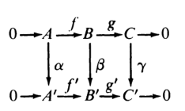
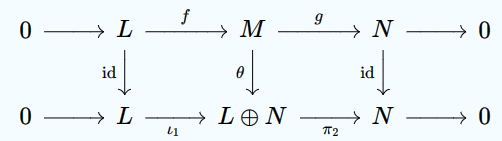
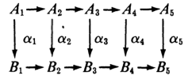

# 模的扩张

- **余像和余核**：设 $f:A\to B$ 是同态
  - **余像**：$\coi f = A/\ker f$ 
    - 原像中的同态等价类，将像相同的元素合并
    - 核心目的是用商消去非单射的影响。余像中 $f$ 是单射
  - **余核**：$\cok f = B/\Im f$
    - 陪域中的像等价类，将陪域用像分解
    - 核心目的是用商消去非满射的影响。余核中 $f$ 是零映射

## 正合列

- **正合列**：模同态链 $A_0\xto{f_1} A_1 \xto{f_2} \cdots \xto{f_n} A_n$ 满足 $\Im f_i = \ker f_{i+1}$
  - **本质**：取补性，$f_{i+1}$ 的像都是 $f_i$ 像的补集（核变余像，像变余核）
  - 正合列本质是刻画群/模扩张的工具，可以判断扩张是否分裂，以及对群/模做分类

### 短正合列

- **短正合列**：$0\to A \xto f B\xto g C \to 0$，其中 $f$ 是单同态，$g$ 是满同态
  - **$f$ 扩张性**：由单同态得 $A\cong \Im f$，故 $f$ 将子模 $A$ 嵌入总模 $B$
  - **$g$ 收缩性**：由定义，$\cok f = B/\Im f = B/\ker g = \coi g \cong C$，故该步使总模 $B$ 被 $A$ 压缩为商模 $C$
  - **本质（最短性）**：
    - 单射是扩张，满射是收缩。普通的正合列中，每个映射 $f_i$ 都必须保证既有扩张又有收缩，也就是既有单射部分，也有满射部分
    - 所以最短的正合列就是都只有一个
- **分裂短正合列**：将模分裂成两个直和因子
- **直和型短正合列**：$0\to A \xto{i} A\oplus B \xto{\pi} B\to 0$
  - **分裂性**：显然
  - 模范畴中，直和型等价于分裂
  - 群范畴中，分裂指的是半直积，故两者不等价
- **商模型短正合列**：$0\to C \xto{i} D \xto{\pi} D/C\to 0$
  - **无分裂性**
    - **反例**：$0\to 2\Z \xto{i} \Z \xto{\pi} \Z_2 \to 0$，其中 $f(n) = 2n$，$g(n) = \begin{cases} 0，偶数 \\ 1，奇数 \end{cases}$
      - 易得 $\Im f = \ker g$，是正合列
      - 但 $\Z\neq \Z\oplus \Z_2$，不是分裂的

### 交换图

- **图**：对象为顶点，态射为边
- **交换图（路径无关性）**：若两端对象相同时，不同路径结果相同，则图称为交换的
  - （物理中的保守力？不定积分的路径无关性？）
- **正合列等价**：存在交换图，且两正合列彼此之间的同态都是同构
- **（引理1.17）短五引理**：
  - 设 $R$ 是环
  - 若下列R模交换图中，两行都是短正合列
  
  - 则 $\a,\g$ 是单/满同态 $\red\Rt \b$ 是单/满同态
  - 追图法：对于闭合的交换图，要证明其中一条边的性质，只需找到另一条通路即可
    - 两条通路的其它映射都是单/满的，故缺失的一条边当然也是单/满的
    - 但要注意不是"任意两个"都成立，因为 $\b$ 正好在 $\a,\g$ 正中间。如果换成 $\a,\b$，由于它们两个已经闭合，故性质与 $\g$ 无关
  - **证明（追图法）**：
    - **单同态传递**：设 $\b(b) = 0$，则只需 $b=0$
      - 由交换图，$\g g(b) = g'\b(b) = g'(0) = 0$，再由 $\g$ 单射性，只能是 $g(b) = 0$
      - 由正合性，$\ker g = \Im f$，从而存在 $f(a) = b$
      - 由交换图，$f'\a(a) = \b f(a) = \b(b) = 0$
      - 由正合性得 $f'$ 是单同态，从而 $\a(a) = 0$，但由 $\a$ 单同态性，得只能是 $a = 0$，故 $b = f(a) = 0$
    - **满同态传递**：设 $b'\in B'$，只需存在对应的 $\b$ 原像即可
      - 由 $\g$ 满射性，存在 $\g(c) = g'(b')$
      - 由正合性，$g$ 是满同态，从而存在 $g(b) = c$
      - 由交换图，$g'\b(b) = \g g(b) = \g(c) = g'(b')$
      - 从而 $g'(\b(b)-b') = 0$，由正合性，可设 $f'(a') = \b(b)-b'$
      - 由 $\a$ 满射性，存在 $\a(a) = a'$
      - 此时 $\b(b-f(a)) = \b(b) - \b(f(a)) = \b(b) - (\b(b)-b') = b'$
  - **本质**：
    - **正合列的刚性**：详见同调代数
    - **等价关系**：若两个正合列间首尾映射的性质相同，则两列等价（因为可以顺便得出总模性质）
- **（定理1.18）分裂定理**：
  - 设 $0\to A_1 \xto{f} B \xto{g} A_2 \to 0$ 是R模同态的短正合列
  - 则下列命题等价
    - **直和性**：该列同构于直和型短正合列 $A_1\oplus A_2$ 
    - **嵌入左可逆（左分裂）**：存在R模同态 $k:B\to A_1$ 满足 $kf = 1_{A_1}$
    - **投影右可逆（右分裂）**：存在R模同态 $h:A_2\to B$ 满足 $gh = 1_{A_2}$
  - **证明**：
    - $(1),(2)\to (3),$：尝试画交换图，凑映射即可
    - $(3)\to (1),(2)$：有右逆等价于满射，有左逆等价于单射
  - **理解**：
    
  - 这就是分裂正合列的常用判定定理

## 习题

- **左右逆与消去律**：设 $f:A\to B$ 是R模同态
  - **左侧单同态可消去**：$f$ 是单同态 $\LR \forall g,h:D\to A$，若满足 $fg = fh$，则 $g = h$
    - **证明**：定义易得
    - **本质**：单态射等价于左逆唯一
      - 单射和原像唯一性关系密切，故右逆唯一
  - **右侧满同态可消去**：$f$ 是满同态 $\LR \forall k,t:B\to C$，若满足 $kf = tf$，则 $k = t$
    - **证明**：定义易得
    - **本质**：满态射等价于右逆唯一
      - 由满射性得左侧映射的原像相同，故不能取分段映射来创造不同的映射法则，从而左逆唯一
  - 其实和R模没什么关系，这是泛函知识，或者说范畴知识
- **单模**：设 $R$ 含幺，$A$ 是非零幺R模。若 $A$ 的R子模只有 $0$ 和 $A$，则 $A$ 是单R模
  - **循环性**：只有循环模是单R模
    - **证明**：若 $A = \lang a,b,... \rang$，则由交换性，$\lang a \rang$ 是R子模，即 $A$ 不是单的
  - **同态平凡性**：单R模的自同态都是零映射或同构（置换）
    - **证明**：
      - 若不是单射，由单模循环性，$f(ka) = 0$。再由同态数乘性，$f(a) = 0$，$A$ 是零模，矛盾。
      - 若不是满射，则存在 $ka\neq \forall f(ma)$，显然不成立
- **循环模同构**：循环幺R模同构于R的某个主理想
  - **证明**：若R特征为0，结论易得
- **循环模等价公式**：循环幺R模均同构于R的某个左理想商环
  - **证明**：设 $R$ 含幺，$\lang a \rang$ 是幺R模，$I$ 是左理想
    - 设 $f:\lang a \rang\to R/I$，要使其为R模同构
      - 左边是对模进行循环约束，右边是对环进行商约束。若要使两种约束等价，只需要找到在循环模下等价的 $R$ 中元素，将这些元素取为理想（商等价类）即可。即 $r_1 a = r_2 a$，取理想 $I_b = \set{r\in R\mid ra = b}$ （水平集）即可
      - 即 $f:\lang a \rang\to R/I_b，(r+n)a \mapsto (r+n+I_b)，(n\in\Z)$
      - 同态公式：任取 $r_0\in R$
        - $f(r_0(r+n)a) = f((r_0r+nr_0)a) = r_0r + nr_0 + I_b$
        - $r_0f((r+n)a) = r_0( r+n+I_b ) = r_0r + nr_0 + I_b$
      - 双射性：分别讨论 $r，n$ 易得单射性，再由 $r,n$ 任意性即得满射性。
  - **本质**：水平集商环都可以写成循环形式
- **生成元系**：有限生成R模不一定是有限生成阿贝尔群
    - **反例**：$\Q$ 自身左模是循环模 $\lang 1 \rang$，但由前面群的习题，其不是有限生成阿贝尔群
    - **本质**：$A$ 作为模时和 $A$ 作为群时，两个生成元系是无关的
      - 因为模生成依赖于环，群生成依赖于自身
- **生成元系无遗传性**：有限生成R模的子模不一定是有限生成的
  - **反例**：
    - 取 $A = \set{f\in \Q[x]\mid 常数项为整数}$，其自身模是有限生成的
    - 取 $I = \set{f\in A\mid 常数项为0}$，其为理想
      - 反设其由 $\set{f_i}^r_{i=1}$ 有限生成，由定义，其等价于 $\forall f\in I，\exists \{g_i\}^r_{i=1}$，满足 $f = \sum\limits^r_{i=1} g_if_i$
      - 设 $f_i$ 的一次项系数为 $a_{i1}\in\Q$，$g_i$ 的常数项为 $n_i\in\Z$，则 $f$ 的一次项系数为 $\sum\limits^r_{i=1}n_ia_{i1}$
      - 由 $f$ 定义，其一次项系数是 $\Q$，也即等价于 $\Q$（$f_i$ 的一次项系数）作为 $\Z$（$g_i$ 的常数项）左模是有限生成的
    - 显然，由于分母数量的限制，任意有限个分数不能通过乘整数生成有理数集
  - **本质**：同上
- **幂等同态**：设 $f:A\to A$ 是R模同态，若其幂等（$ff = f$），则 $A = \ker f\oplus \Im f$
  - 不是线性空间，故没有维数公式，一步步来吧
  - **证明**：易得像与核仅相交于 $0$
    - 只需证明 $\forall a\in A，\exists b\in \ker f，c\in \Im f$，使得 $a = b+c$ 即可
      - 若 $a\in \ker f$，则取 $b = a，c=0$ 即可
      - 若 $a\notin\ker f$，则可设 $f(a) = d$
        - **引理**：幂等单射只能是恒等映射
          - **证**：由幂等性，任取 $f(a) =b$，则 $f(f(a)) = f(b) = b$。再由 $a,b$ 任意性即得结论
        - 从而不妨设 $f$ 不是单射。此时只需考虑像集中存在多个原像的元素。即存在 $b$ 满足 $f(b) = d$。再由同态性，$b-a\in \ker f$，从而 $b,c$ 存在性得证
  - **本质**：这好像也是泛函题……而且这题没意思。不妨看看hx问我的另一个问题，证明（自伴算子与幂等算子的复合）是投影算子
- **像核互补性**：设 $f:A\to B，g:B\to A$ 是R模同态
  - 若 $gf = 1_A$，则 $B = \Im f\oplus \ker g$
  - **证明**：
    - **像核不相交性**：易得若 $b\in \Im f$，则 $\exists f(a) = b$，从而 $a = g(f(a)) = g(b)$，从而不可能有 $b\in \ker g$
    - **直和表出性**：设 $b\notin \Im f$，即 $\forall a\in A，f(a)\neq b$
      - 再设 $g(b) = a$，再由于 $g(f(a)) = a$，由同态得 $b-f(a)\in \ker g$，即得直和性
  - **本质**：这种一眼线性空间的题统统用泛函思路做就行
- **直和分解**：设 $R$ 含幺，$A$ 是R模，则存在子模 $B,C$ 满足 $A = B\oplus C$
  - （其中 $B$ 是幺模，$RC = 0$）
  - **证明**：
    - 已知陪集映射 $h:A\to RA，a\mapsto Ra$ 是R模同态
    - 此时 $C = \ker h$，$B = \Im h$
    - 再由 $RRa = Ra$，得 $h$ 幂等，从而结论成立
  - **同态缩小性**：若 $f:A\to A_1$ 是R模同态，则 $f(B)\subset B_1，f(C)\subset C_1$
    - **证明（元素分析法）**：
      - $f(B)$ 中元素都可写成 $f(Ra) = Rf(a)\in RA_1 = B_1$，结论得证
      - $f(C)$ 中元素 $f(c)$，由于 $RC = 0$，故 $Rf(c) = f(Rc) = 0$
        - 再由于 $\forall c$，若 $Rc = 0$，则 $c\in C_1$，故 $f(c)\in C_1$，结论得证
    - **证明（集合比较法）**：
      - $f(B) = f(\Im h) \subset \Im hf =  B_1$
      - $f(C) = f(\ker h) \subset \Ker hf  = C_1$
      <!-- - $\ker f \cup (\ker h\cap \Im f)$，显然 $f(C) = \Im f$ -->
  - **单满传递性**：同态的单射和满射性可传递到 $B,C$ 限制上来
    - **证明**：
- 设 $\{A_i\}^n_{i=1}$ 是R模族，
- **模嵌入定理**：设 $R$ 是无幺环，将其嵌入含幺环 $S$ 中，则
  - $S$ 中元素可表为 $r1_S + n1_S\pad (r\in R，s\in\Z)$
  - 若 $A$ 是R模，则 $\forall a\in A$，存在唯一的R模同态 $f:S\to A，f(1_S) = a$
    - **证明**：设 $f(r1_S + n1_S) = ra + na$ 即可

#### 挠性质

- **零因子理想**：$R$ 是交换环，$A$ 是R模，则 $\forall a\in A，\ms O_a = \set{r\in R\mid ra = 0}$ 是理想
- **挠元素**：当 $\ms O_a\neq 0$ 时，$a$ 是 $A$ 的挠元素（阶在环中的有限阶）
- **挠子模**：若 $R$ 是整环，则所有挠元素的集合 $T(A)$ 是 $A$ 子模
  - **反例**：R有零因子时，
  - **同态缩小性**：若 $f:A\to B$ 是R模同态，则 $f(T(A))\subset T(B)$
    - **推论**：$f_T:T(A)\to T(B)$ 也是R模同态
  - **正合传递性**：若 $0\to A \xto{f} B \xto{g} C$ 是R模正合列，则 $0\to T(A) \xto{f_T} T(B) \xto{g_T} T(C) \to 0$ 也是R模正合列
  - **无满射传递性**：

#### 正合列

- **五引理**：下列R模交换图中，每行是正合列，则
  
  - 若 $\a_1$ 是满同态，$\a_2,\a_4$ 是单同态，则 $\a_3$ 是单同态
  - 若 $\a_5$ 是单同态，$\a_2,\a_4$ 是满同态，则 $\a_3$ 是满同态
  - **证明**：
- **复合性**：
  - 若 $\begin{cases} 0\to A\to B\xto{f}C\to 0 \\ 0\to C\xto{g} D\to E\to 0 \end{cases}$ 均是模的短正合列
  - 则 $0\to A\to B\xto{gf}D\to E\to 0$ 是正合列
  - **证明**：定义易得
  - **反例**：单射和满射的复合既不单也不满
    - $f:\R\to [0,\infty)，x\mapsto x^2$ 是满射
    - $g:[0,\infty) \to [0,\infty)，x\mapsto \sqrt{x+1}$ 是单射
    - 但 $gf:\R\to [0,\infty)，x\mapsto \sqrt{x^2+1}$ 不单也不满
- **分解性**：每个正合列都可分解成多个上面的短正合列
  - **证明**：只需要 $A\to B$ 是单射，$D\to E$ 是满射，$f$ 满，$g$ 单
    - 只需证明任何映射 $h:X\to Y$ 都可分解为满射 $f$ 和单射 $g$ 的复合即可
      - **像集限制** $f:X\to \Im h，x\mapsto h(x)$，易得其为满射
      - **平凡延拓** $g:\Im h\to Y，h(x)\mapsto h(x)$，易得其为单射
      - 此时 $h = gf$
  - **推论（具体的分解方法）**：
    - 设正合列 $0\xto{f_0}A_1\xto{f_1}A_2\xto{f_2}\cdots A_{n-1}\xto{f_{n-1}}A_n\xto{f_n}0$
    - **首尾不变性**：显然 $\ker f_0 = 0$，其为单射，$\Im f_n = 0$，其为满射，也就是说，短正合列的首尾部分不变即可
    - **复合归零性**：任取 $g_k = f_{k+1}\circ f_{k}$，由正合列定义，$g_k$ 是零映射
    - **逐步分解**：$f_1 = gf$，其中 $g$ 单，$f$ 满，即 $A_1\xto{f}\Im f_1\xto{g} A_2$
- **等价性**：短正合列的同构是等价关系

#### 例子

- **同余类模**：设 $A$ 是交换群。若存在 $n\in\N^+$，满足 $\forall a\in A，na = 0$，则 $A$ 是幺 $\Z_n$ 模，作用为 $\ol ka = ka$
- **最大同态**：任意含幺环 $R$ 的模同态都是 $\Z$ 的模同态，即 $\Hom_R(A,B)\subset \Hom_\Z(A,B)$
  - **证明**：线性公式 $f(ra + na) = rf(a)+nf(a)$，由于 $0\in R$，显然可得结论
- **理想衍生模**：设 $I\in\I_{R_L}，A\in\M_R$
  - 若 $S$ 是非空子集，则 $IS = \set{\sum\limits^n_{i=1} r_ia_i\mid n\in\N^+，r_i\in I，a_i\in S}$ 是子模
    - **证明**：理想封闭性即得数乘封闭性
    - **实例**：$S = \{a\}$，则 $IS = Ia = \set{ra\mid r\in I}$
  - 若 $I$ 是双边理想，则 $A/IA\in \M_{R/I}$
    - **证明**：数乘作用为 $(r+I)(a+IA) = ra + IA$
- **反环模**：若 $A$ 是左 $R$ 理想，则 $A$ 是右 $R^{op}$ 模，满足 $ra = ar'$
  - **证明**：$ra \in A$，即 $A$ 是左R模。由反环定义，$ra = ar'\in A$，从而是右 $R^{op}$ 模
- **R模范畴的态射类**：设 $A,B$ 是 $R$ 模，则 $\Hom_R(A,B)$ 是所有 $A\to B$ 模同态的集合
  - **同态群**：若 $A,B$ 是R模，则（所有A到B的R模同态） $\Hom_R(A,B)$ 是阿贝尔群
    - **证明**：
      - 群加法为 $(f+g)(a) = f(a) + f(b)$，易得满足交换性
      - 幺元是零映射
  - **自同态环**：$\Hom_R(A,A)$ 是含幺环
    - **证明**：
      - 环加法同上
      - 环乘法是函数复合
      - 零元为零映射，幺元为恒等映射
  - **自同态模**：$A$ 是左 $\Hom_R(A,A)$ 模，数乘作用就是同态映射 $fa = f(a)$
  - **作用同态**：存在 $\p:A\to \Hom_R(R,A)，a\mapsto f_a$ 是同态
    - **证明**：取 $f_a(r) = ra$ 即可
- **代数整数环（$\Z$ 模）**：设 $d\in \Z$ 无平方因子，则 $R = \begin{cases} \Z[\sqrt{d}]  & d\equiv 2,3\pmod 4 \\ \Z[\dfrac{1+\sqrt{d}}{2}] & d\equiv 1\pmod 4 \end{cases}$ 称为 $\Q(\sqrt{d})$ 的代数整数环
  - **有限生成性**：$R$ 作为 $\Z$ 模是有限生成的（即有限生成阿贝尔群）
    - **证明**：

