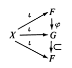

# 模范畴的自由对象

## 自由模

- **线性无关**：若R模元素 $x_1,...,x_n\in X$ 满足下列非零式，则称线性无关 $$\exists r_i\in R\ 使得\ r_1x_1 + ... + r_nx_n = 0 \red\Rt \forall r_i = 0$$
- **生成集**：模 $A$ 中可张成 $A$ 的子集称为生成集
- **基**：线性无关的生成集
  - Hamel基又称代数基，可以仅由代数结构定义
  - Schauder基需要拓扑结构，所以代数学中不用
- **（定理2.1）自由模的四个定义**：设 $R$ 是含幺环，$F$ 是它的模，则下列命题等价
  - $F$ 有非空基 $X$
  - $F$ 是其（循环子模的弱内直积）
    - $F = \sum\limits_{i\in I} \lang x_i \rang$，其中 $x_i\in X$ 是各个基元素
  - $F$ 同构于（自身模 $R$ 的直积）
    - $F\cong \prod\limits_{i\in I}R$，其中 $\lang x_i \rang\cong R$，即 $rx_i\neq 0\pad (\forall r\neq 0,x_i)$（由线性无关性直得）
  - $F$ 是（R模范畴）上的自由对象
  - **证明**：和自由阿贝尔群相同
  - **实例**：
    - 零模是空集上自由对象
  - **反例（不是幺模则不成立）**：
- **（推论2.2）自由表出性**：含幺环 $R$ 的模 $A$ 都是自由模 $F$ 的同态像
  - **证明**：由自由对象定义直得
  - **推论**：有限生成性可由 $A$ 传递给 $F$（在群里面是 $G$ 生成元系的阶 = 基的秩）
    - **证明**：
    - **反例？**：$A$ 生成元系的阶不一定等于 $F$ 的秩

### 向量空间的基

- **（引理2.3）向量空间的基**：除环 $D$ 上向量空间 $V$ 的极大线性无关组 $X$ 是基
  - **证明**：同高代
    - 反设 $W$ 是 $X$ 生成的真子空间，存在 $a\in V-W$
    - 则 $X\cup \{a\}$ 中考虑非零式 $ra + \sum\limits^n_{i=1} r_ix_i = 0$，
      - 若 $r\neq 0$，则由 $r$ 可逆性，$a$ 可被 $X$ 线性表出，与定义矛盾，从而只能是 $r=0$。再由于 $X$ 的线性无关性，$r_i$ 也只能是0，从而 $X\cup\{a\}$ 是更大的线性无关组，矛盾
- **（定理2.4）向量空间自由性**：向量空间均有基
  - 除环的模都是自由模
  - **证明**：同泛函
    - 设 $X$ 是线性无关子集，$\mc S$ 是包含 $X$ 的线性无关集族，定义包含偏序。
    - 由于并运算不保持线性无关性，不能简单用所有 $S\in\mc S$ 的并来充当上界
    - 由于全序链中线性无关性可传递，故取该链所有集合的并，即为该链的上界
    - 故由Zorn引理，存在极大线性无关组 $B$，已知其为基，且包含 $X$
  - **推论（逆命题成立）**：若含幺环的模均自由，则其为除环
- **（定理2.5）向量空间基的收缩扩张原理**：
  - 向量空间的线性无关子集均含于基
  - 向量空间的生成集均包含基
  - **证明**：
    - 设 $X$ 可张成 $V$， $\mc S$ 是 $X$ 的线性无关子集族。在其上定义包含偏序，同上由Zorn引理得存在 $X$ 中的极大线性无关组 $Y$
    - 此时易得 $Y$ 可表出 $X$，从而 $Y$ 可张成 $V$。再由线性无关性，$Y$ 是 $V$ 的基
  - **反例（非向量空间不成立）**：
    - 设 $R = \Z$，自由模 $F = \Z$，易得基只有 $\pm\{1\}$
      - $S = \{2\}$ 线性无关，但不含于基
      - $S = \{2,3\}$ 是生成集，但不包含基

### 习题

- **线性相关的表出定义法**：
  - 设 $\{x_1,...,x_n\}$ 是除环 $R$ 上向量空间 $V$ 的子集
  - 则其线性相关 $\LR \exists x_k$ 可被其它元素线性表出
  - **证明**：显然

## 自由模的传递性

- **无遗传性**：自由模的子模不一定自由
  - **反例**：$A = \{0,2,4\}$ 是 $\Z_6$ 的自身子模，$\Z_6$ 对于自身自由，但 $A$ 对于 $\Z_6$ 不自由
    - **证明**：（$\Z_6$ 模的范畴很小，容易用定义讨论）
      - $\Z_6$ 自身是循环模，生成元系为 $\lang 1 \rang$，易得基也为 $\{1\}$
      - 其线性包 $\Z_6$ 是自由对象，从而可唯一同态于任意 $\Z_6$ 模
        - 设 $A_k = \{0,a,2a,...,ka\}\pad (k\leq 5)$
        - 取 $\ker\ol f = \{(k+1)a,...,5a\}$ 即可
        - 易得 $A$ 不是自由模
    - **理解**：
      - 自由阿贝尔群的子群必须含幺，只需满足加法封闭
      - 自由模的子模不一定含幺，同时要满足加法和数乘封闭
      - 要求更严，条件更松，当然不成立了
- **（引理2.10）商传递性**：
  - 设 $R$ 是含幺环，$I$ 是真理想，$F$ 是存在基 $X$ 的自由R模
  - 若 $\pi:F\to F/IF$ 是商映射
  - 则 $F/IF$ 是自由 $R/I$ 模，基为 $\pi(X)$，维数为 $|X|$
  - **证明（自由模）**：
    - 只需证明 $\pi(X)$ 是基即可
    - **构造非零式**：
      - 设 $u+IF\in F/IF$，则可设表出式 $u = \sum\limits^n_{j=1} r_jx_j$
      - 易得 $\pi(X)$ 是 $F/IF$ 的生成集，故 $$ u+IF = \sum_j (r_jx_j+IF) = \sum_j (r_j+I)(x_j+IF) = \sum_j (r_j+I)\pi(x_j)$$
    - **验证非零性**：
      - 由 $F/IF$ 的零元存在性，存在 $\sum\limits^m_{k=1} r_kx_k \in IF$，从而存在 $i_k\in I,f_k\in F$ 使得 $\sum\limits^m_{k=1} r_kx_k = \sum\limits_{k} i_kf_k$
      - 再由基的线性表出性，存在 $c_t\in I，y_t\in X$ 使得 $\sum\limits^{|X|}_{t=1}c_ty_t = \sum\limits_{k} i_kf_k$
      - 再由基的线性无关性，只能是 $|X| = m，\forall c_t = r_k，\forall y_t = x_k$
    - 综上即得 $\pi(X)$ 在 $R/I$ 上线性无关，从而 $F/IF$ 是自由 $R/I$ 模，基为 $\pi(X)$
  - **证明（维数）**：
    - 反设 $\pi$ 不是单射，则存在 $\pi(x) = \pi(x')$
    - 此时 $(1_R + I)\Big[ \pi(x)-\pi(x') \Big] = 0$，故只能是 $1_R\in I$，从而不是真理想，矛盾

## 秩和维数

- **秩**：非除环上基的势
- **维数**：除环上基的势

### 秩不变环（IBN环）

- **秩不变性**：设 $R$ 是含幺环，若任意自由R模的基均等势，则称 $R$ 具有秩不变性
  - **反例（非除环的秩不变环）**：
    - $\Z$ 上的自由模
    - $GL_n(\mb F)$
  - **反例（非秩不变环）**
- **（定理2.6）无限秩不变定理**：设 $R$ 是含幺环，自由模 $F$ 存在无限基 $X$，则其基都与 $X$ 等势
  - （环的秩不变性）只在讨论（它的有限基自由模）时使用
  - **证明**：类似自由阿贝尔群的证明
- **（定理2.7）向量空间维数不变性**：向量空间的基均等势
  - 除环都是秩不变环
  - **证明**：由前面结论得显然
- **（命题2.9）基同构定理**：秩不变环中，自由模 $E\cong F \LR \rank E = \rank F$
  - **证明**：
    - 由基的生成性，构造同构映射即可

### 秩不变环的传递性

- **（命题2.11）秩不变的商反传递性**：
  - 设 $S$ 是秩不变含幺环
  - 若存在非平凡满同态 $f:R\to S$，则 $R$ 也是秩不变含幺环
  - 由同态基本定理，满同态像都同构于某个商环
  - **证明**：
    - 由同态基本定理，设 $I = \ker f$，则 $S\cong R/I$
    - 设 $X,Y$ 都是自由模 $F$ 的基，$\pi:F\to F/IF$ 是商映射
      - 由自由模的商传递性，$F/IF$ 是 $R/I$ 的自由模，即 $S$ 的自由模，从而 $|X| = |\pi(X)|，|Y| = |\pi(Y)|$
      - 再由 $S$ 的秩不变性得 $|\pi(X)| = |\pi(Y)|$，从而 $|X| = |Y|$
  - **反例（无正向传递性）**
- **（推论2.12）秩不变的同态判定法**：
  - 设 $R$ 是含幺环
  - 若 $R$ 可被保幺同态到除环上，则 $R$ 具有秩不变性
  - **证明**：
    - 变为满同态情况，再由向量空间秩不变性 + 秩不变的商反传递性即可
    - **构造满同态**：
      - 设 $\p:R\to S$ 是保幺同态
      - 由同态基本定理，存在典范同态 $\pi:R\to R/\ker\p$ 是满同态
      - 由保幺性，$\Im \pi$ 是除环 $D$ 的含幺子环
  - **反例（逆命题不成立）**：
    - $R = \prod\limits^\infty_{n=1}\Z$ 是IBN环，但不能同态到除环
- **秩不变定理**：含幺交换环是秩不变环
  - **证明**：
    - 已知含幺交换环存在极大理想 $M$，且 $R/M$ 是域，故由同态判定法直得结论

### 向量空间的维数公式

- **（定理2.13）商空间维数公式**：
  - 设 $W$ 是除环 $D$ 上向量空间 $V$ 的子空间
  - 则 $\dim_D V = \dim_D W + \dim_D(V/W)$
  - **证明**：
    - 同高代，对基证明即可
  - **推论**：
    - $\dim_D W\leq \dim_D V$
    - 若 $\dim_D W = \dim_D V \leq \infty$，则 $W = V$
- **（推论2.14）像核维数公式**：
  - 设 $f:V\to V'$ 是除环 $D$ 上向量空间的线性变换
  - 则 $\dim_D V = \dim_D (\ker f) + \dim_D (\Im f)$
  - **证明**：
    - 只需证明存在 $V$ 的基 $X$ 满足以下两点即可
      - $X\cap \ker f$ 是 $\ker f$ 的基
      - $f\ddkh{X\j \ker f}$ 是 $\Im f$ 的基
- **（推论2.15）子空间维数公式**：
  - 设 $V,W$ 是除环 $D$ 上的有限维向量空间
  - 则 $\dim_D V + \dim_D W = \dim_D(V\cap W) + \dim_D(V+W)$
  - **证明**：
    - 只需对基证明即可
- **（推论2.16）环的维数公式**：
  - 设除环 $R\subset S\subset T$
  - 则 $\dim_R T = (\dim_S T)(\dim_R S)$
  - **证明**：
    - 设 $U$ 是 $T$ 作用 $S$ 时的基，$V$ 是 $S$ 作用 $R$ 时的基，只需证明 $\hkh{vu\mid v\in V,u\in U}$ 是 $T$ 作用 $R$ 时的基

### 习题

- **直和维数公式**：设 $V$ 是有限维向量空间，$V^m$ 是 $m$ 次直和，则 $\dim V^m = m\dim V$
  - **证明**：
- **直和秩公式**：
  - 设 $R$ 是秩不变环，$F_1,F_2$ 是其上两个自由模
  - 则 $\rank (F_1\oplus F_2) = \rank F_1 + \rank F_2$
  - **证明**：
- **有限维线性变换的性质**：
  - 设向量空间 $V,V'$ 维数有限且相同，$f:V\to V'$ 是线性变换
  - 则 $f$ 是同构 $\LR f$ 是满同态 $\LR f$ 是单同态

## 一般的自由模

- **模范畴的自由对象**：设 $R$ 是环，$X$ 是非空集合，则下列条件等价
  - $F$ 是左 $R$ 模范畴中 $X$ 上的自由对象
  - 存在 $\iota:X\to F$，使得对任意左R模 $A$ 和函数 $f:X\to A$，存在唯一的R模同态 $\ol f:F\to A，\ol f\iota = f$
- **范畴R模余积定理**：
  - 设
    - $\hkh{X_i\mid i\in I}$ 是两两不相交的集合，$F_i$ 是 $X_i$ 上的自由模
    - $X = \mathop{\bigcup}\limits_{i\in I}X_i，F = \sum\limits_{i\in I} F_i$
    - $\phi_i:F_i\to F$ 是规范逆投影
  - 若存在 $\iota:X\to F，x\mapsto \phi_i\iota_i(x)，x\in X_i$，则 $F$ 是 $X$ 上的自由模
  - **证明**：
    - 参考范畴论即可
- **自由模生成元系**：
  - 设 $R$ 是环，$F$ 是 $X$ 上的自由R模，$\iota:X\to F$ 同上
  - 则 $\iota(X)$ 是 $F$ 的生成元系
  - **证明**：
    - 设 $G$ 是 $F$ 中由 $\iota(X)$ 生成的子模，则此时存在模同态 $\p$ 满足如下交换图，只需证 $\p = 1_F$ 即可
  
- **自由模存在定理**：对任意环 $R$ 和任意集合 $X$，都存在 $X$ 上的 $R$ 自由模
  - **证明**：
    - 已知 $X$ 是其中单元素子集的不交并，不妨设 $X$ 是单元素集合
    - 若 $R$ 含幺，则用2
    - 若 $R$ 无幺，则嵌入 $S$ 中，只需证明 $S$ 是自由R模
- **子模存在定理**：
  - 设 $R$ 是秩不变环，$F$ 是 $R$ 上的无穷秩自由模，基数为 $\a$
  - 则对任意正整数 $\b\leq \a$，$F$ 都有无穷个秩为 $\b$ 的子模
  - **证明**：
- **基存在定理**：
  - 设 $F$ 是含幺环上的自由模
  - 若 $F$ 有基数为 $n$ 和 $n+1$ 的两组有限基
  - 则对任意正整数 $m\geq n$，$F$ 存在基数为 $m$ 的基
  - **证明**：
- **自身不自由性**：含幺环 $R$ 不是R模范畴上任何集合的自由模
  - **证明**：
    - 设 $A$ 是全零R模，则 $R\to A$ 的模同态只有零映射

### 习题

- 设 $V$ 是除环 $D$ 上的向量空间，$S$ 是 $V$ 的所有子空间定义包含偏序，则
  - $S$ 是完备格
  - $S$ 是
- 若 $G$ 是非平凡群，则 $G$ 存在无幺自同构
  - 提示

### 杂题

- 1
  - 设 $R$ 是无零因子环，$\forall r,s\in R，\exists a,b\in R$ 满足 $ar + bs = 0$
  - 若自身模 $R = K\oplus L$，则要么 $K = 0$，要么 $L = 0$
  - 若 $R$ 含幺，则其具有维数不变性
- 2
  - 设 $K$ 是含幺环，$F$ 是自由 $K$ 模，基不可数。则 $R = \Hom_K(F,F)$ 是自同态环
  - 若 $n$ 是正整数，则自由左R模 $R$ 含有 $n$ 元素基（对任意有限的 $m$，都有 $R\cong \sum\limits^m_{i=1} R$）
  - **证明**：
    - $\{1_R\}$ 是单元素基
    - $\{f_1,f_2\}$ 是二元素基，$\begin{cases} f_1(e_{2n}) = e_n  \\ f_1(e_{2n-1}) = 0 \end{cases}，\begin{cases} f_2(e_{2n}) = 0 \\  f_2(e_{2n-1}) = e_n \end{cases}$
    - 且任意 $g\in R$ 都可写成 $g = g_1f_1 + g_2f_2$，其中 $\begin{cases} g_1(e_n) = g(e_{2n}) \\ g_2(e_n) = g(e_{2n-1}) \end{cases}$
- 3
  - 设 $R$ 是含幺环，交换群 $\Z$ 上取全零R模，即 $R\oplus \Z$ 是R模，作用为 $r(r',m) = (rr',0)$
  - 若 $X = \{t\}$，设 $\iota:X\to R\oplus\Z，\iota(t) = (1_R,1)$
  - 则 $R\oplus \Z$ 是 $X$ 上的自由模
  - **证明**：
    - 可设 $f:X\to A$，取直和分解 $A = B\oplus C$，使得 $f(t) = b+c$
    - 再设 $f(r,m) = rb + mc$ 即可

## 例子

- 设 $R$ 是主理想整环，$A$ 是幺左R模，$p\in R$ 是素数，则
  - $R/(p)$ 是域
  - $pA$ 和 $A[p]$ 是 $A$ 子模
  - $A/pA$ 是 $R/(p)$ 上的向量空间，作用为 $(r+(p))(a+pA) = ra + pA$
  - $A[p]$ 是 $R/(p)$ 上的向量空间，作用为 $(r+(p))a = ra$
- $\dim_\R \C = 2，\dim_\R \R = 1$
- 不存在域 $K$ 满足 $\R\subset K\subset \C$