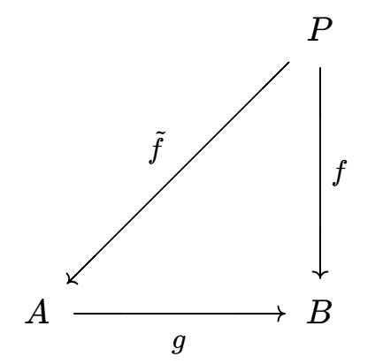
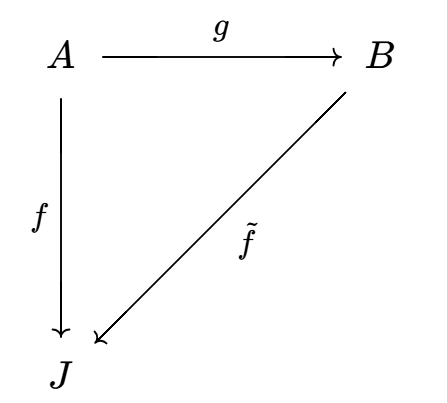

# 模范畴的泛对象

- **对偶概念**：某范畴中，若一个性质成立，则可在其对偶范畴中导出另一个成立
  - 单态射和满态射是对偶概念
  - 直积和余积是对偶概念
  - 内射模和投射模是对偶概念（实际上应该叫做嵌入模和投影模，或单射模与满射模）
  - 线性空间和对偶空间也是对偶概念
- **本质**：
  - 投射模是泛对象，内射模是余泛对象
    - **泛性**：它们都是一种无固定形态的模的抽象。
    - **起始点性**：所有模都存在（指向内射模）和（被投射模指向）的映射
  - 基可以是一种方便的理解方式，但绝不是本质的、正确的理解。
  - 到了范畴层次的数学，任何对象都只用泛性质来定义，并没有实体。只有具体范畴才可能存在基这种规范化的具体定义
  - 所以说这个阶段，我们最重要的是做到“习惯它”，也就是说不要老想着一个定义的本质或几何意义是什么。实际上范畴论已经是本质了，我们应该以应用为导向，因为任何一个对象或范畴都是因为在实际问题中有研究价值才被提出来的。

## 投射模

- **$R$ 投射模**：
  - **特征定义法**：
    - 设 $P$ 是模
    - 若任取满同态 $g$，存在模同态 $\tilde f$ 使得下图交换（$gh = f$）
    - 则 $P$ 称为投射模，$\tilde f$ 称为 $f$ 的**提升同态**
    
    - 本质（可提升性）：投射模是"可被任意投影提升"的模
      - 它指向被压缩对象 $B$ 的任意同态，都能无损地抬回到原对象 $A$ 上
  - **直和定义法**：设 $P$ 是模，若存在 $P\oplus Q$ 是自由模，则 $P$ 是投射模
    - 本质（自由模的直和因子）：自由模可任意投影到模中，故投射模作为自由模的直和因子时，其同态总能提升
  - **正合列定义法**：若任意短正合列 $0\to A\to B\to P\to 0$ 都分裂，则 $P$ 是投射模
    - 本质（正合列语言）：就是把总能提升换成了正合列的语言
  - **实例**：
    - 若 $P$ 是幺模，则 $P$ 是投射模 $\LR$ 对任意幺模 $A,B$ 和满同态 $g$ 都存在 $h$
    - 若 $A = A_1\oplus A_2，B = B_1\oplus B_2$，其中 $A_1,B_1$ 是幺模，$RA_2 = RB_2 = 0$（就是之前的练习）
- **（定理3.2）自由投射性**：含幺环 $R$ 上的自由模 $F$ 都是投射模
  - **证明**：由自由对象的定义，易得满足投射模的正合列定义法
  - **反例（投射模不是自由模）**：
    - 设 $R,S$ 是环，$I = R\times 0，J = 0\times S$，都是左理想 $R\times S$ 模
      - 此时 $I\oplus J = R\times S$，由于任意环在看作自身作用模时均是自由模，故 $I,J$ 都是 $R\times S$ 投射模
      - 但由于 $I$ 和 $J$ 之间不存在同态关系，故均不是 $R\times S$ 自由模
  - **推论（无幺表述）**：若 $R$ 无幺，$F$ 改为左R模范畴上自由对象，则也成立
    - 虽然自由模只考虑含幺环，但是无幺时也可以用自由对象代替，性质一样
- **（推论3.3）投射模表出性**：R模都是某个投射R模的同态像
  - **证明**：自由模都是投射模，故自由模表出性直得结论
  - **本质**：投射模是模范畴的泛对象
- **（定理3.4）投射定理**：若含幺，则下列命题等价
  - $P$ 是投射模
  - 每个短正合列 $0\to A\xto f B \xto g P \to 0$ 都是分裂正合列
    - 也即 $B\cong A\oplus P$，等价于短正合列中必须是直和关系
  - 存在自由模 $F$ 和模 $K$ 使得 $F\cong K\oplus P$
    - 自由模强调“自由”，即生成是自由的。投射模强调“投射”，即可经同态指向任何模。我们之前说自由模表出性，本质应该是投射模表出性
    - 但实际上，表出性和基是等价的。投射模具有表出性，那么它必须得有基（但可以不是被基自由生成的，即在某些模范畴中可人为加上一些限制）故其和自由模也是直和关系。
  - **证明**：
    - $(1)\to (2)$：考虑 $B\xto{g} \overset{\overset{\normalsize P}{\bigm\downarrow}1_P}{\hspace{-0.5em}P}\xto{} 0$ 部分，则由投射模定义，存在 $g$ 的右逆，从而由分裂定理得分裂性
    - $(2)\to (3)$：考虑 $0\to \ker g\xto{\subset} F \xto g P \to 0$，易得其正合性，再由分裂性即得等价于直和
    - $(3)\to (1)$：已知直和中存在规范满射、规范单射。从而将自由模投射性从 $F$ 传到 $P$ 即可
- **（命题3.5）直和投射性**：设 $R$ 是环，R模直和 $\sum\limits_{i\in I} P_i$ 是投射模 $\LR P_i$ 均为投射模
  - **证明**： 仿照上面证明，将投射性通过规范映射传递
  - **本质**：无论多小，投射模都对应一个基。反过来说，只要有基就是投射模。而基在取直和与取直和因子下均封闭

### 例子

- 设 $R = \Z_6$，则 $\Z_2$ 是R投射模，$\Z_3$ 不是R投射模
  - **模结构**：显然作用是良定义，故 $\Z_2,\Z_3$ 都是R模，且存在模同构 $\Z_6\cong \Z_2 \oplus \Z_3$
  - $\Z_2$：
    - **短正合列**：$0\to \Z_3 \xto{i} \Z_6 \xto{\pi} \Z_2\to 0$ 分裂

## 内射模

- **$R$ 内射模**：
  - **特征定义法**：
    - 设 $J$ 是模
    - 若任取单同态 $g$，存在模同态 $\tilde f$ 使得下图交换（$\tilde{g}f = g$）
    - 则 $P$ 称为内射模，$\tilde{f}$ 称为 $f$ 的**扩张同态**
    
    - 本质（可扩张性）：内射模是"可被任意嵌入扩张"的模
      - 被扩张对象 $B$ 指向它的任意同态，都能被整体扩张到对象 $B$ 上
  - **直和定义法**：设 $J$ 是模，若任意模 $B\supset J$ 都有 $B = J\oplus B/J$，则 $J$ 是内射模
    - 本质（分裂语言）：即分裂正合列的直和写法
  - **正合列定义法**：若任意短正合列 $0\to J\to B\to C\to 0$ 都分裂，则 $J$ 是内射模
    - 本质（正合列语言）：即可扩张性的正合列语言
  - **内射包定义法**：任意模都能嵌入到内射模中
    - 本质（内射包）：对偶于投射模的自由模投影性，内射模有内射包嵌入性
- **（命题3.7）直积传递性**：$\prod\limits_{i\in I} J_i$ 是内射模 $\LR J_i$ 均为内射模
  - **证明**：仿照直和投射性即可
- **（引理3.8）内射引理**：
  - 若 $R$ 是含幺环，则 $J$ 是内射模 $\LR$ 任意模同态 $L\to J$ 都可延拓到 $R$ 上
  - 即任何R模都可嵌入 $R$（已知任何线性空间都同构于数组空间，按照相同方法证明即可）
  - **证明（必要性）**：考虑 $0\to \underset{\underset{J}{\downarrow}}{L}\xto \subset R$，应用内射模的正合列定义法即可
  - **证明（充分性）**：
    - 设短正合列 $0\to A\xto{g} B$，只需找到同态 $h:B\to J$ 即可满足交换性
    - 设 $\mc S$ 是满足 $\Im g\subset \Dom h \subset B$ 的同态 $h$ 全集，偏序关系是定义域包含。易得其全序链的分段复合即为上界，由Zorn引理，其存在最大元 $\wt h$
    - 反设 $\Dom \wt h= H \subsetneqq B$，则存在 $b\in B-H$
      - 易得 $L = \{r\in R\mid rb\in H\}$ 是 $R$ 的左理想，从而也是R模
        - 则 $L\to J，r\mapsto \wt h(rb)$ 是R模同态
      - 由题设可延拓性，存在 $k:R\to J，r\mapsto \wt h(rb)$，设 $c = k(1_R) = \wt h(b)$
      - 则存在 $\wt h$ 的同态延拓 $\ol h:(H+Rb)\to J，a+rb\mapsto \wt h(a)+rc$
        - 线性公式：
          - $\ol h(r(a+rb) + n(a+rb)) = \ol h\Big( (r+n1_R)a+(r^2+nr)b \Big) \\ = \wt h((r+n1_R)a) + r^2c+nrc$
           
          - $r\ol h(a+rb) + n\ol h(a+rb) = r\wt h(a) + n\wt h(a) + r^2c+nrc$
          - 由 $\wt h$ 的同态性即得相等
        - 延拓性：由幺模性得 $1_Rb = b\notin H$，从而 $H\subsetneqq H+Rb$
      - 即与 $\wt h$ 的上界性矛盾，故只能是 $H=B$

### 阿贝尔群范畴的内射模

- **可除阿贝尔群（可除群）**：$\forall y\in D，\forall n\neq 0\in\Z，\exists x\neq y\in D$ 使得 $nx = y$
  - **本质**：
    - 从模的角度，等价于可除 $\Z$ 模
    - 从阿贝尔群的角度，其为阿贝尔群短正合列的内射模
  - **实例**：
    - 有理数加法群 $Q$ 是可除阿贝尔群，但整数加法群 $\Z$ 不是（1和素数无法表出）
  - **直和等价性**
  - **同态传递性（遗传性）（商传递性）**
- **（引理3.9）可除的内射性**：阿贝尔群 $D$ 是可除的 $\LR D$ 是内射 $\Z$ 模
  - **必要性**：
    - 由 $\Z$ 主理想性，群同态都可写为 $f:\lang n \rang\to D\pad (\forall n\in\Z)$ 的形式，则由 $D$ 可除性得 $\exists x\in D$ 使得 $nx = f(n)$
    - 则此时 $h:\Z\to D，1\mapsto x$ 是 $f$ 的同态延拓，此时由内射延拓性引理即得 $D$ 是内射模
  - **充分性**：若是内射模，则 $f:\lang n \rang\to D，n\mapsto y$ 是同态
    - 由于 $\lang n \rang$ 是自由Z模，内射模延拓性引理得短正合列 $0\to \lang n \rang \xto\subset Z$ 交换
    - 此时若 $x = h(1)$，则 $nx = h(n) = f(n) = y$，从而可除
  - **理解**：可除阿贝尔群具有延拓性，是内射延拓性引理的直接推论
  - **本质**：通过内射模，将阿贝尔群完全特征化（见习题中的可除分解定理）
- **（引理3.10）可除表出性**：每个阿贝尔群 $A$ 均可嵌入一个可除阿贝尔群中
  - **证明**：
    - 自由阿贝尔群性质得存在自由 $\Z$ 模 $F$ 和满同态 $f:F\to A$。再由模的同构定理即得 $F/\ker f\cong A$
      - 定义易得 $F\cong \sum\Z$ 可被单嵌入有理数直积 $D = \prod \Q$
      - 再由直积内射性 + 可除群的内射性，易得 $D$ 是可除群
    - 此时 $g:F\to D$ 是单嵌入，也即 $F/\ker f \cong g(F)/g(\ker f)$
      - 再由 $A\cong F/\ker f\cong g(F)/g(\ker f)\subset D/g(\ker f)$
        - 得 $h:A\to D/g(\ker f)$ 是嵌入
        - 而 $D/g(\ker f)$ 为 $D$ 的商同态像，故由可除的同态传递性即得结论
  - **理解**：
    - $\ker f$ 是 $A$ 中没有取到的基，$g(\ker f)$ 是这些基在 $\prod\Q$ 中的线性包
    - $D/g(\ker f)$ 是削除没取到的基后，$A$ 中存在的基在 $\prod\Q$ 中的线性包，显然这是一个单嵌入
  - **本质**：
    <!-- - 类似基的最大最小性
    - 在 $\Z$ 模（可张成 $\Z$ 模的群）中，可除阿贝尔群 $\prod\Q$ 最小 -->
    - 在所有交换群（$\prod\Z$ 的子集，直积因子不相交性类似线性无关性）中，可除阿贝尔群 $\prod\Q$ 最大（不要忘了 $\Q$ 也是 $\Z$ 的直积）

### 同态群范畴的内射模

- **诱导同态**：若 $\p: A\to A'$ 是同态，则 $\ol \p:\Hom(A,B)\to \Hom(A',B)$ 一般也是同态
- **（引理3.11）同态群的内射性**：设 $J$ 是可除阿贝尔群，$R$ 是含幺环，则 $\Hom_\Z(R,J)$ 是左R内射模
  - **证明**：
    - 设 $L$ 是 $R$ 的左理想，$f:L\to \Hom_\Z(R,J)$ 是R模同态
    - 只需找到 $f$ 的延拓 $h$ 即可
      - 易得 $g:L\to J，a\mapsto \Big[ f(a) \Big](1_R)$ 是群同态
      - 再由可除阿贝尔群 $J$ 是内射 $\Z$ 模，可得交换图 $\injl{L}{g}{J}\xto{\subset} \injr{R}{\ol g}$
      - 由内射模可延拓性，存在群同态的延拓 $\ol g:R\to J$
    - 设 $h:R\to \Hom_Z(R,J)$，其中 $\forall r,x\in R，h(r): R\to J，x \mapsto \ol g(xr)$
      - R模同态性：由 $\ol g$ 是同态，直得结论
        - $\Big[ h(r_0r+nr) \Big](x) = \ol g(x(r_0r+nr)) = \ol g(x)$
      - 延拓性：由 $\ol g$ 是延拓，直得结论
  - **理解**：由可除阿贝尔群内射模性，得到群同态延拓性。再构造作用同态即可
  - **本质**：内射模性质可通过作用同态传递

### 内射模被表出性

- **（命题3.12）内射被表出性**：含幺环的模都可嵌入一个内射模中
  - **证明**：
    - 设 $R$ 是含幺环，$A$ 是模
    - 由可除表出性，存在可除阿贝尔群 $J$ 和嵌入 $f:A\to J$
      - 则诱导同态 $\ol f:\Hom_\Z(R,A)\to \Hom_\Z(R,J)，g\mapsto fg$ 是单同态
      - 再由 $R$ 模同态也都是 $\Z$ 模同态，从而 $\Hom_R(R,A)\subset \Hom_\Z(R,A)$，构成子模关系
      - 已知存在作用同态 $\p:A\to \Hom_R(R,A)，a\mapsto f_a$，其中 $f_a(r) = ra$
    - 最终得嵌入链 $A\to \Hom_R(R,A)\xto{\subset}\Hom_\Z(R,A)\xto{\ol f} \Hom_\Z(R,J)$
  - **理解**：可除群是内射 $\Z$ 模，其同态群具有最大性和内射R模性。再由作用同态存在性，可在同态群上完成到内射 $R$ 模的转变
  - **本质**：投射表出性的对偶命题
    - 由内射模的正合列定义法可直得
- **（命题3.13）内射定理**：若含幺，则下列命题等价
    - $J$ 是内射模
    - 每个短正合列 $0\to J \xto f B \xto g C \to 0$ 都是分裂正合列
    - $J$ 是任意模 $B\supset J$ 的直和因子
  - **证明**：
    - $(1)\to (2)$：仿照投射模
    - $(1)\to (3)$：内射模直和等价性直得
    - $(2)\to (3)$：考虑 $0\to J\xto{\subset} B\xto{\pi} B/J\to 0$
      - 由短正合性，商映射 $\pi$ 存在右逆 $g$
      - 则 $f:J\oplus B/J\to B，(x,y)\mapsto x+g(y)$ 是同构，从而 $B = J\oplus B/J$

## 习题（若R含幺，则R模都是幺模）

- **良性质**：【幺】环 $R$ 中下列命题等价
  - 【幺】R模均为投射模
  - 【幺】R模的短正合列均为分裂正合列
  - 【幺】R模均为内射模
  - **证明**：
    - $(2)\to (1)$：考虑短正合列 $B\xto{g} P\to 0$，由 $g$ 是满射得其有右逆 $f$，从而由 $B$ 任意性 + 正合列定义法，即得 $P$ 构成投射模
    - $(2)\to (3)$：同上
    - $(1)\to (2)$：
  - **理解**：如果R模构成的范畴性质良好（可分裂成各个基张成的子模），那么其可以用基来完全表示投射与内射性质。
  - **实例**：除环 $D$ 上的向量空间都是投射模和内射模
- **更良性质**：设 $R$ 是含幺环，若幺R模均自由，则其为可除环
  - **证明**：
    - 已知最大理想总存在，则最大理想模是自由的，且所有子理想都是自由R模
    - 但此时真理想不可能同构于 $\sum R$，故最大理想只能是 $(0)$
    - 由[习题结论](6.一般环.md)（含幺环是除环等价于其无真左理想），即得其为除环
- 若 $R$ 含幺，则下列命题等价：
  - R模 $A$ 是内射模
  - 对任意左理想 $L$ 和R模同态 $g:L\to A$，存在 $a\in A$ 使得 $g(r) = ra\pad (\forall r\in L)$
  - **证明**：
    - **必要性**：由内射延拓性，有交换图 $\injl{L}{g}{A}\xto{\subset}\injr{R}{\ol g}$
      - 此时 $$
- 不用内射可除性证明
- **对偶自由（实际上不存在）**：设 $F$ 是R模，$X$ 是集合
  - 若存在 $\iota:F\to X$ 使得对任意R模 $A$ 和函数 $f:A\to X$，存在唯一的模同态 $\ol f:A\to F$ 使得 $\iota\ol f = f$ 
  - 则 $F$ 在 $X$ 上对偶自由
  - **推论（不存在性）**：
    - $\forall |X|\geq 2$，不存在对偶自由R模
      - **证明**：反设 $F$ 存在，则 $0$ 的像。构造 $f:R\to X$ 使得 $\forall \ol f，\iota\ol f \neq f$
    - $|X| = 1$ 时，$0$ 是唯一的对偶自由R模

### 可除群分解定理

- **既约阿贝尔群**：交换群 $N$，没有非平凡的可除子群
- **交换群的可除分解**：若 $G$ 是阿贝尔群，则其可分解为（可除阿贝尔群 $D$）和（既约阿贝尔群 $N$）的直和，即 $G = D\oplus N$
  - **证明**：由可除遗传性，可设 $D = \bigm\lang \bigcup G_i \bigm\rang$，其中 $G_i$ 是 $D$ 的所有可除子群
- **可除的真正意义**：无挠的可除阿贝尔群 $D$ 同构于有理数集的直和
  - **证明**：由无挠可除性，$\forall n\neq 0，a\in D，\exists! b\in D$ 满足 $nb = a$，可设为 $b = \dfrac{a}{n}$
    - 易得 $m(\dfrac{a}{n}) = \dfrac{m}{n}a$，即 $D = \Q\cdot D$，从而 $D$ 是除环 $\Q$ 上的向量空间。由向量空间自由性 + 自由模直和性即得结论
  - **理解**：无挠使得逆唯一，从而系数可整除任意整数，从而真正进化为有理数自由模
- **可除群的挠分解**：若 $D$ 是可除群，则 $D = D_t\oplus E$，其中 $E$ 无挠
  - **引理**：设 $D$ 是阿贝尔群，$D_t$ 是挠子群，则 $D/D_t$ 是无挠的
    - **证**：定义易得
  - **证明**：遗传性得若 $D$ 可除，则 $D_t$ 也可除，
  - **理解**：
- **可除 $p$ 群的分解**：若 $D$ 是可除交换 $p$ 群，则 $D$ 是 $\Z(p^\infty)$ 的直和
  - **证明**：设 $X$ 是 $\Z_p$ 上向量空间 $D[p]$ 的基
    - 若 $x\in X$，则存在 $x_1,...\in D$ 满足 $\begin{cases} x_1 = x \\ |x_1| = p \\ px_{n+1} = x_n \end{cases}$
    - 若 $H_x$ 是 $x_i$ 生成的子群，则 $H_x\cong \Z(p^\infty)$
    - 再易得 $D\cong \sum\limits_{x\in X}H_x$，从而结论成立
- **可除群的分解**：可除交换群同构于 $\Q$ 和 $\Z(p^\infty)$ 的直和
  - **证明**：
    - 已知可除群 $D$ 可被挠分解为 $D_t\oplus E$
    - 其中 $D_t$ 可被分解为 $p$ 群直积，从而是 $\Z(p^\infty)$ 的直和
    - 其中 $E$ 可被分解为 $\Q$ 的直和
  - **推论**：设 $G,H,K$ 是可除交换群
    - 若 $G\oplus G\cong H\oplus H$，则 $G\cong H$
    - 若 $G\oplus H \cong G\oplus K$，则 $H\cong K$

### 例子

- $Z(p^\infty)$ 是可除群
- （非平凡有限阿贝尔群）均不是可除群
  - **证明**：已知有限阿贝尔群均可分解为循环群的有限直和
    - 故设 $A = \sum\limits^m_{i=1}\lang a_i \rang$，则 $\forall (k_1a_1,...,k_ma_m)\in A，\forall n\in \Z$，若有 $nx = y$，则必有 $x = (\dfrac{k_1}{n}a_1,...,\dfrac{k_m}{n}a_m)$，显然不可能
- （非平凡自由阿贝尔群）均不是可除群
  - **证明**：已知自由阿贝尔群均可分解成（各个基的循环群的内直和）
    - 故设 $F = \sum\limits_{i\in I}\lang x_i \rang$，证明方法同上
- $\Q$ 是可除阿贝尔群
  - **证明**：定义易得
- $\Q$ 不是投射 $\Z$ 模
  - **证明**：反设存在R模 $A$，使得 $\Q\oplus A$ 同构于自由 $\Z$ 模 $F\cong \sum \Z$（自由阿贝尔群）
    - 由于前面已证 $\Q$ 不是自由阿贝尔群，从而其中必有 $\Z_p$ 直和因子，从而其任意直和也不是自由阿贝尔群，矛盾
