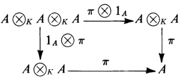

# 代数

## 基本概念

- **K(作用)代数（交换K模）**：设 $K$ 是含幺交换环，则 满足下列条件的交换环 $A$ 是 $K$ 代数
  - **模性**：$(A,+)$ 是幺左K模
  - **数乘交换律**：$\forall a,b\in A，k\in K$，都有 $k(ab) = (ka)b = a(kb)$
- **可除K代数（可逆交换K模）**：$A$ 同时还是除环
- **有限维代数（等价于有限维向量空间）**：（$K$ 是域）$A$ 是维度有限的向量空间
- **实例**：
  - **$\Z$ 代数**：环都是Z模，易得也是Z代数
  - **多项式代数**：若 $K$ 是含幺环，则多项式环和形式幂级数环都是K代数
  - **线性变换代数**：若 $V$ 是域 $F$ 上向量空间，则自同态环 $\Hom_F(V,V)$ 是F代数
  - **环中心代数**：设 $A$ 是含幺环，$K$ 是其中心的含幺子环，则 $A$ 是K代数
    - 含幺交换环是自身代数
  - $\C$ 和实四元除法环都是 $\R$ 上的可除代数
  - **群代数**：$G$ 是乘法群，$K$ 是含幺交换环，则群环 $K(G)$ 是K代数，模结构为 $K(\sum r_ig_i) = \sum(kr_i)g_i$
  - **矩阵代数**：若 $K$ 是含幺交换环，则其上所有 $n$ 阶方阵是K代数
  - **交换性**：交换环上的左右K模是同一个
- **（定理7.2）**：设 $K$ 是含幺交换环，$A$ 是左K幺模，则
  - **积映射**：$A$ 是K代数 $\LR $ 存在K模同态 $\pi:A\otimes_K A\to A$ 满足下面交换图
  
  - **单位映射**：$A$ 含幺 $\LR $ 存在K模同态 $I:K\to A$ 满足下面交换图（$\zeta,\t$ 是同构）
  
  - **证明**：

## 子代数

- **子代数**：子环，同时也是K子模
- **代数理想**：环的理想，同时也是K子模
- **K代数同态**：环同态，同时也是K模同态
- **（定理7.4）K代数的张量积**：设 $A,B$ 是含幺交换环 $K$ 上的代数
  - 设 $\pi$ 是映射 $(A\otimes_K B)\otimes_K (A\otimes_K B) \xto{1_A\otimes \a \otimes 1_B} (A\otimes_K A)\otimes_K (B\otimes_K B) \\ \xto{\pi_A\otimes \pi_B} A\otimes_K B$
    - 其中 $\pi_A,\pi_B$ 是积映射
  - 则 $A\otimes_K B$ 在积映射 $\pi$ 下是K代数
- **证明**：