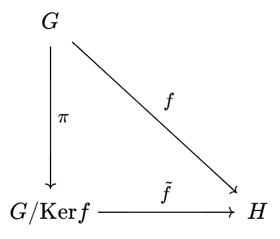
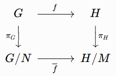

# 群在映射下的结构和性质

## 像与核

- **核**：$\ker f = \hkh{g\in G\mid f(g) = e}$
- **同态的性质**：
  - **保幺型**：$f(e) = e$
  - **保逆型**：$f(g^{-1}) = f(g)^{-1}$
  - **保群性**：
    - 子群的像是子群
    - 核是子群
  - **像同余性**：同像等价类同余于 $\ker f$
    - **推论**：单同态的核仅有 $e$
- **广义逆定理**：设 $f$ 是同态，$K$ 是子群，则 $f^{-1}\circ f(K) = K \LR \ker f < K$
  - **证明**：
    - **必要性**：$K$ 必须包含 $e$ 的全部原像，否则逆映射的像大于 $K$
    - **充分性**：讨论即可
- 幺半群同态不一定成立 $f(e) = e$
  - **反例**：至今未得

## 商群

- **商群**：设 $N\lhd G$，则 $G/N = \{Na\mid a\in G\}$ 称为 $G$ 关于 $N$ 的商群
  - 正规子群陪集的集族
  - **运算法则**：$(aN)(bN) = (ab)N$
  - **性质**：
    - **不相交性**：若 $Na = Nb$，则 $a=b$
      - **证明**：
        - 若 $a$ 或 $b\in N$，则 $Na = N$，故不妨设 $a,b\notin N$
        - 若 $na = nb$，则由可逆性得 $a=b$
        - 若 $n_1a = n_2b$，则 $n_2^{-1}n_1 = a^{-1}b$，与 $a,b\notin N$ 矛盾
      - **推论（商映射是单射）**
    - **逆直积性**：商群是直积的逆运算
      - **证明**：详见后面
    - **正规子群的商遗传性**：设 $N_1\leq N_2$，若 $N_1,N_2\lhd G$，则 $N_2/N_1\lhd G/N_1$
      - **证明**：
        - 由夹逼性得 $N_1\lhd N_2$，再由定义易得结论
- **整数加法群的商群**：$\Z/n\Z \cong \Z_n$
  - **证明**：
    - 由交换性，$\Z$ 的子群都是正规的
    - 再由 $n\Z = \{0,n,-n,\cdots\}$ 即得 $$\Z/n\Z = \hkh{n\Z,\cdots,n\Z+(n-1)} % = \hkh{0,p,-p,\cdots\} , \cdots, \{p-1,2p-1,-1,\cdots\}} \color{chartreuse} \equiv \set{1,2,3,\cdots,p-1}\pmod p$$
    - 再易得它是 $n$ 阶循环群，故同构于 $\Z_n$
- **循环群的商群**：$\Z_n/\Z_m \cong \Z_{\frac{m}{n}}$
  - $n$ 阶循环群关于 $m$ 阶正规子群的商群是 $\dfrac{n}{m}$ 阶循环群
  - **实例**：
    - $G = \Z_{10}，H = \{0,5\}\cong \Z_2$
    - 则 $G/H = \set{H,H+1,H+2,H+3,H+4} = \hkh{\{0,5\},\{1,6\},\{2,7\},\{3,8\},\{4,9\}}$
    - 即 $G/H \cong \Z_5$
  
### 商映射

- **商映射（群投影）**：$\pi: G\to G/N，a\mapsto Na$
  - **理解**：将（陪集 $Na$ 内元素）压缩为（陪集 $Na$）（将等价类 $Na$ 看作一个元 $a$）
  - **实例**：$\pi: \Z\to\Z_p，g \mapsto \bar g\pmod p$

### 代表元群

- **代表元群（截群）**：
  - 设 $\bar a = \{g\in G\mid Ng = Na\}$，则代表元系 $R_N = \{\bar a\mid  a\in G\}$
  - 定义运算，使得 $\ol a\ol b$ 是 $R_N$ 中唯一满足 $abN = \ol a\ol bN$ 的元素
  - 则该群称为截群 $G\| N$
  - 代表元系在原群运算下不是群，但在商群运算下是群
- **同构性**：$G/N \cong G\| N$
  - **证明**：
    - 只需 $\forall a\in G$，$f:G/N \to G\| N，N\bar{a} \mapsto \bar{a}$ 是双射且满足同构式即可
    - **单射性**：反设 $\exists \bar a_1\neq \bar a_2$，使得 $f(N\bar a_1) = f(N\bar a_2)$
      - 定义易得矛盾
    - **满射性**：反设 $\exists g\in G$ 使得 $\forall a\in G，f(N\bar a) \neq \bar g$
      - 则 $\bar a\neq g$，也即 $Na \neq Ng(\forall a\in G)$，这不可能
    - **同构式**：$f(N\bar a)f(N\bar b) = \bar a\bar b = Im = f(N\bar a\bar b) = f(N\bar aN\bar b)$

## 群映射基本定理

### 同态基本定理

- **同态基本定理**：设 $f:G\to H$ 是同态，则 $G/\ker f \cong \Im f$
  - 通过它可以快速求出商群
  - **证明**：
    - 像：同态乘积性（群） + 映射缩小性（子群）
    - 核：（Artin）同态乘积性 + 幺元素交换性（正规）
  - 群同态基本定理实际上就是商群的特征性质，商映射也叫自然映射或规范映射
- **诱导同态**：设 $f:G\to H$ 是同态，则 $\wt f: G/\ker f\to H$ 称为它的诱导同态
  - 类似商拓扑，商群也有如下的交换图
  
  - **商映射万有性质**：对每个 $N\lhd G$，均存在唯一的同态 $\tilde f: G/N \to H$
    - 已知同态的核是正规子群，易得群同态和正规子群一一对应，
    - **证明**：
      - **存在性**：易得存在同态 $f$ 满足 $\ker f = N$
      - **唯一性**：$\tilde f\pi = f$，已知 $\pi,f$ 均依赖于 $N$，得其唯一性，再传递到 $\tilde{f}$
  - **性质传递**：$f$ 的单射、满射性可传递到 $\wt f$ 上
    - **单同态条件**：$\ker f = \{e\}$
    - **满同态条件**：$\Im f = G$
- **诱导同态存在定理**：
  - 设 $f:G\to H$ 是同态，$N\lhd G$
  - 若 $f(N)\leq M$，则 $g:G/N\to H/M$ 也是同态
  - 实际上它就是商群万有性质的广义情况
  
  - **证明**：
    - 令 $g(aN) = f(a)M$ 即可
    - 同态式：$g(aNbN) = g(abN) = f(ab)N = f(a)f(b)N = f(a)Nf(b)N = g(aN)g(bN)$
  - **推论（同构条件）**：当 $f(N) = M$ 且 $\ker f \subset N$ 时同构
    - **证明**：
      - $g$ 可看作复合映射 $\pi \tilde{f}$
      - 再由规范同构性质，得前者是满同态条件，后者是单同态条件

### 同构基本定理

- **第一同构定理**：设 $f$ 是同态，则 $\bar{f}: G/\ker f \to \Im f$ 是同构
  - 就是同态基本定理，表明"群同态、正规子群、商群是一一对应关系，在研究时可以转换视角"
  - **证明**：
    - **满射性**：衍生映射缩小性 + 衍生映射像集为 $Im\ f$
    - **单射性**：已知 $\ker \tilde{f} = (\ker f)/N$，因此其当 $\ker f= N$ 时为 $\{e\}$
  - **本质**：像与核的对偶关系（关于对偶的理论在[模对偶关系](./9.模对偶关系.md)中有更详细讨论）（一般线性群中，正规子群是特殊线性群，商群是行列式值相同的矩阵。$\ol f$ 是行列式映射，像与核是转置正交补关系）
- **第二同构定理**：商群的集合运算
  - 若 $N\lhd G，K\leq G$
  - 则 $K/(K\cap N) \cong (NK)/N$
  - 前面习题说过子群乘积和交集是互补运算，这里是互补关系在商群中的体现
  - 通过正规子群表明群的商结构
  - **证明（Hungerford）**：
    - 设 $f:K\to (NK)/N$，由第一同构定理，只需 $\Im f = (NK)/N$，即可得 $\wt f:K/(K\cap N)\to (NK)/N$ 是同构
    - 由正规性 $\forall nkN = kn'N = kN = f(k)$，由任意性即得结论
  <!-- - **证明（有问题）**：设 $f:K\to NK，k\mapsto nk$ 为同态
    - 此时 $f(\ker f) = N\cdot \ker f = e$，即 $\ker f \subset N^{-1} = N$
    - 再由 $f$ 定义域为 $K$，从而 $\ker f = K\cap N$
    - 故此时 $\wt f$ 为 $\Big(K/\ker f = K/(K\cap N)\Big)\to NK$
      - 再由 $f(K\cap N) = N(K\cap N) = N$（？？）
      - 即 $g = \pi\wt f$ 满足商群同构条件，它就是题设的同构关系
    - 问题在于 $f$ 取错了，应该取的和Hungerford一样，但那样就证明手法也一样了…… -->
  - **理解**：右边的很大一部分陪集平移都是在 $N$ 在 $N$ 内部的无意义平移，真正有意义的就是N和K相交的那一部分在K中的移动而已。而把右边的K和N交叠部分剥离出来，就是左边
  - **本质**：商群的非直积运算
- **第三同构定理**：商群的复合运算
  - 设 $N_1\leq N_2$，$N_1,N_2\lhd G$
  - 则 $(G/N_2)/(N_1/N_2) \cong G/N_1$
  - 研究商群的性质本质商也是在研究群同态的性质
  - **证明（Hungerford）**：
    - 易得同构函数就是 $f: G/N_2\to G/N_1$
  - **理解**：正规子群的逆遗传性
- **实例**
  - $\Z/p\Z \cong \Z_p$
    - **同态（同余类代表元映射）**：满同态，不是单同态
    - **诱导同构**：恒等映射
    - **诱导单同态**：满射
  - $GL_n(\R)/SL_n(\R) \cong $
    - **同态（行列式映射）**：满同态（行列式矩阵乘法），不是单同态（偶置换）
    - **商群**：行列式值为 $\N^+$ 的矩阵
    - **诱导同构**：行列式映射

### 中间群

- **保子群定理**：
  - 令 $S(H)$ 表示某个群 $H$ 的子群集族，$K\leq G$
  - 若 $f:G\to H$ 是满同态
  - 则将子群映射为子群的衍生映射 $\varphi: K\mapsto f(K)$ 满足
    - 双射性
    - 像集与原像集为 $\ker f\cup S(G)\to S(H)$
    - 正规子群一一对应
  - **证明**：反证法 + 取样法即可
- **中间群**：$\mu = \{K\mid N\leq K\leq G\}$ 称为群 $N$ 和 $G$ 的中间群
- **中间群定理**：若 $N<K<G$，则 $G/N$ 的子群均可表为 $K/N$
  - **证明**：对投影应用保子群定理
  - **推论**：
    - **正规子群的商群传递**：$K\lhd G\LR K/N\lhd G/N$
<!-- - **四元群的结构**：$Z_4$ 或 $K_4$
  - 若有四阶元素，则为四阶循环群
  - 若无四阶元素，则元素只能为2阶
    - **证明（排除法）**：$\lang a\rang = \{1,a\}$，则 $G/\lang a\rang$ 为二阶子群 $\{b,ba\}$
      - 然后证明 $ab \neq a,b,1$，是克莱因四元群（**证毕**） -->
    - **群的直积不传递同构性**：二阶群只有一种结构，所以 $Z_4、K_4$ 两者的正规子群和商群均相互同构，但是原始群不相互同构

## 习题

### 一般线性群的商群

- **特殊线性商群**：$GL_n(\mb F)/GL_n(\mb F) \cong \mb F^*$
  - 一般线性群/特殊线性群
- **射影一般线性群**：$PGL_n(\mb F) = GL_n(\mb F)/Z$
  - 一般线性群/纯量矩阵群 
- **射影特殊线性群**：$PSL_n(\mb F) = SL_n(\mb F)/Z$
  - 特殊线性群/纯量矩阵群 

### 正规闭包

- **正规闭包**：设 $R$ 是群 $G$ 中元素集合，则（包含 $R$ 的正规子群）的全体交称为 $R$ 的正规闭包 $\iip{R}$
  - **正规子群性**：
    - **证明**：由交传递性易得
  - **核传递性**：
    - 设 $N$ 是 $R$ 在 $F$ 中的正规闭包，$f:F\to G$ 是同态
    - 若 $R\subset \ker f$，则 $N\subset \ker f$
    - **证明**：
      - 正规闭包的最小性 + 同态基本定理直得结论

### 正规化子

- **正规化子商传递性**：
  - 设 $N\lhd G，N\leq M\leq G$
  - 则 $N_G(M)/N = N_{G/N}(M/N)$
  - **证明**：
    - **充分性**：
      - 已知 $x^{-1}(m_1N)x = (m_2N)，(x\in G/N)$，则可设 $x = yN$
      - 此时证 $y\in N_G(M)$ 即可
      - 已知条件转化为 $(yN)^{-1}(m_1N)(yN) = (y^{-1}m_1y)N = (m_2N)$
      - 也即 $y^{-1}m_1y = m_2$（**证毕**）
    - **必要性**：
      - 已知 $x^{-1}m_1x = m_2\pad (x\in G)$
      - 则此时 $(xN)^{-1}(m_1N)(xN) = N(x^{-1}m_1Nx)N$
      - 再由 $N$ 正规性，可化为 $N(x^{-1}m_1x)N = Nm_2N = m_2N$
      - 从而 $xN\in G/N$ 是 $M/N$ 的正规化子（**证毕**）
- **逆映射扩大性**：
  - 设 $f:G\to H$ 是同态，$M\leq G$
  - 则 $f^{-1}\circ f(M) = \ker f\cdot M$
  - **证明**：易得
  - **推论**：
    - 若同态 $f:G\to H$ 中，$K<G$，则
      - $f^{-1}\circ f(K) = K\LR \ker f<K$
      - $f^{-1}\circ f(K) = K\cdot\ker f$
    - **证明**：逆映射扩大性直得
- **商群与阶**：
  - 设 $N\lhd G$，若 $\gcd\ddkh{|g|,|G/N|} = 1$，则 $g\in N$
    - **证明**：
      - 反设 $g\notin N$（可有可无），取同态 $f:G\to H$，其中 $\ker f = N$
      - 则 $f(gN) = f(g)$，由同态阶缩小性，右式的阶整除 $|g|$，左式的阶整除 $|G/N|$，但由互素得只能是两边阶均为 $1$，但一阶元素只有 $e$，也即只能是 $g\in N$
    - **理解**：对于商群来说，用同态的语言去思考是一种重要的方法。这也是要提出同态基本定理和规范同态概念的原因
      - 可以说商群就是同态，同态就是商群。它们是一个问题的两种视角，如同线性变换和矩阵是也是同一概念的两种视角一样。
- **正规子群包含定理**：设 $N\lhd G，K\leq G$
  - 若 $|K|$ 和 $[G:N]$ 均有限且互素，则 $K\leq N$
    - **证明（同态法）**：由商群定义，$[G:N] = |G/N|$，此时由商群与阶的结论可直得
      - （此时N和G可能是无限生成群，但K是有限群，其生成元系是可以归纳的）
    - **证明（整除法）**：
      - 由正规性，$NK = KN$，从而 $NK\leq G$，故 $[G:NG] \mid [G:N]$
      - 再由阶运算公式，$[NK:N] = [K:N\cap K]$，右式整除 $|K|$，从而只能是 $[NK:N] = 1$，即 $K\leq N$
  - 若 $|N|$ 和 $[G:K]$ 均有限且互素，则 $N\leq K$
    - **证明（同态法）**：$(|N|,t) = 1$，则 $(\dfrac{|G|}{|N|}, \dfrac{|G|}{t}) = 1$，由拉格朗日，即可转化为上个结论（错的）
      - 反设 $g\in N$ 但 $g\notin K$，取同态 $f:K\to H_0$，其中 $\ker f = K\cap N$
      - 此时只需证明 $K\cap N = N$ 即可。而由第二同构定理，
    - **证明（整除法）**：将上述结论换个序即可
  - **本质**：第二同构定理和陪集计算公式类似，都是处理非直积的情况
- **商群运算（第三同构定理推论）**：
  - 若 $N_1\lhd G_1，N_2\lhd G_2$，则
  - $(N_1\times N_2)\lhd (G_1\times G_2)$
  - $(G_1\times G_2)(N_1\times N_2) \cong (G_1/N_1)(G_2/N_2)$
  - **证明**：积运算定义即可
  - **本质**：商与直积是完全兼容的运算
- **弱直和引理**：设 $N\lhd G，K\lhd G$，若 $N\cap K = \lang e \rang，N\lor K = G$，则 $G/N\cong K$
  - **证明**：详见群与范畴的[弱直和定理](./3.群与范畴.md)
- **阿贝尔同态**：若同态 $f:G\to H$ 中，$H$ 是阿贝尔群，则任意子群 $N\supset \ker f$ 都是正规子群
  - **证明**：归纳法，只需证 $N = \lang \ker f,a \rang$ 即可
    - 即只需 $\forall g\in G，g^{-1}ag \in \lang \ker f,a \rang$ 即可
    - 此时 $f(g^{-1}ag) = f(g^{-1})f(a)f(g)$，由于像是阿贝尔群，可化为 $f(a)$，从而 $g^{-1}ag \in a\cdot \ker f$（**证毕**）
  - **理解**：交换与共轭的奇妙产物
- **有理加法商群**：$Q/Z = \set{n\cdot\dfrac{p}{q}\mid p,q,n\in Z，(p,q) = 1}$
  - **本质**：相当于把 $R$ 上的 $Q$ 简化成了 $[0,1)$ 上的 $Q$
  - $Z(p^\infty) = \set{a/b\in Q/Z \mid a,b\in Z，b = p^i}$（详见[素幂阶子群](4.阿贝尔群的结构)）
    - 加法无限循环群
    - 生成元 $\lang \ol{1/p^n} \rang$
    - [挠群](./5.有限群的结构.md)，元素阶为 $p^n\pad (n\in N^+)$
    - 更多在习题3.7、5.21

