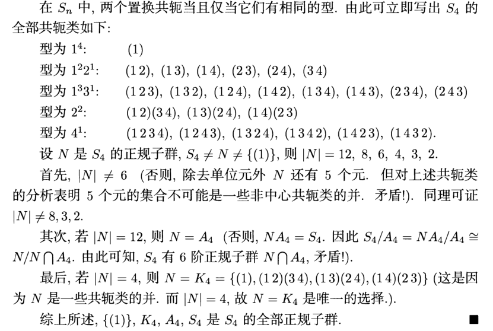

# 置换群

## 置换的群

- 本章内容在[群作用](5.有限群的结构.md)中可以看得更清楚
- **置换** $\sigma$：集合 $D$ 到自身的一一映射
  - **字典**：集合 $D$
  - **文字**：集合 $D$ 的元素
  - **矩阵表示法**：$\tvek{1 & 2 & 3}{a_1 & a_2 & a_3}$，表示第1,2,3个元素被置换为第 $a_1,a_2,a_3$ 个元素
- **对称群** $S(D)$：字典 $D$ 上所有的置换构成的乘法群，阶为 $n!$
  - **证明**：
    - **封闭性**：易得
    - **含幺性**：恒等置换
    - **可逆性**：易得
- **对称群标准型**：$n!$ 阶对称群都同构于 $\Z_n$ 上的对称群
  -  以后都将对称群写为 $S_n$ 的形式
  - **证明**：
    - $a_i$ 和 $p_i = \tvek{a_1 & a_2 & \cdots & a_n}{a_ia_1 & a_ia_2 & \cdots & a_ia_n}$ 一一对应
    - 保乘法性易得
  - **实例**：$S_3 = \set{(1),(12),(13),(23),(123),(132)}$
    - $3$ 个文字的排列方法共有 $A^3_3 = 3!$ 种，也就是说，把 $123$ 置换后的不同结果有 $3!$ 中，从而 $|S_3| = 3!$
- **置换群**：对称群的子群

## 置换的分解

### 轮换

- **长为 $t$ 的轮换**：$(a_1a_2...a_t)$，其中 $a_i\to a_{i+1}$（轮换中元素均左移一格，其它元素不变）
- **轮换的运算**：
  - **无交换性**
    - **反例**：
      - $1234 \xto{(1234)} 2341 \xto{(1342)} 1423$
      - $1234\xto{(1342)}3142\xto{(1234)}4213$
  - **逆运算**：$(a_1a_2...a_t)^{-1} = (a_t...a_2a_1)$
  - **穿脱原理**
- **轮换的相等**：若两个轮换中元素的相对位置均相同，则两轮换相等
  - **实例**：
    - $(123) = (231) = (312)$
    - $(132) = (321) = (213)$
    - 长为3的轮换只有两种，且互逆，阶为 $3$
  - **数量定理**：阶为 $n$ 的字典中，长为 $m$ 的不同轮换共有 $C^m_nA^{m-1}_{m-1}$ 个
    - 首先选出元素的方式有 $C^m_n$ 种，然后将这些元素排成轮换（由于轮换存在相等的情况，我们只需从第二个元素开始变动）
  - **阶定理**：$S_n$ 中，长为 $m$ 的轮换阶为 $m$
    - 详见对换
- **轮换分解定理**：置换是轮换的乘法
  - **算法**：观察轨道等价类，分别讨论即可
  - **实例**：$\tvek{123456}{132564} = (1)(23)(456)$
    - 有三个轨道，$\{1\},\{23\},\{456\}$

### 对换

- **对换**：长为2的轮换
- **对换分解定理**：$n$ 阶轮换可分解为 $n-1$ 个对换相乘
  - **通用公式**：
    - $(123) = (12)(13)$
    - $(1234) = (12)(34)(13)$
    - $(12345) = (12)(34)(13)(15)$
    - $(123456) = (12)(34)(56)(13)(15)$
    - $(a_1a_2...a_t)$
      - $t$ 为奇数时
        - 首先是 $(a_1a_2),(a_3a_4),\cdots,(a_{t-2}a_{t-1})$
        - 然后是 $(a_1a_3),(a_1a_5),\cdots,(a_1)(a_{t-2})$
        - 最后补上 $(a_1a_t)$
      - $t$ 为偶数时
        - 首先是 $(a_1a_2),(a_3a_4),\cdots,(a_{t-1}a_t)$
        - 然后是 $(a_1a_3),(a_1a_5),\cdots,(a_1)(a_{t-1})$
    - **理解**：第一步先解决一个数的位置（偶数序号的数），第二步再解决另一个数（奇数序号的数）的遗留问题（类似容斥原理的算法）
  - **实例**：
    - $(1342) = (13)(42)(14)$
      - $1234\xto{(1342)}3142$
      - $1234\xto{(13)}3214\xto{(42)}3412\xto{(14)}3142$
    - $(1423) = (14)(23)(12)$
      - $1234\xto{(1423)}4312$
      - $1234\xto{(14)}4231\xto{(23)}4321\xto{(12)}4312$
- **对换乘法**：
  - **互素交换性**：互素的对换可交换
  - **换序公式（标准化公式）**：$(12)(23) = (213) = (132) = (13)(12)$
    - 不知道你有没有发现，因为对换的阶太小了，所以你都不用算，直接猜就能猜出来。比如 $(12)(13)$ 换序时，肯定不能换过来还是 $(13)(12)$，所以只能是 $(13)(23)$。同理，上面最后一步中，$(12)(23)$ 闭着眼睛也知道拼接成的轮换不是 $(123)$，故只能是 $(132)$
  - **既约对换**：元素均不相同（等价于一个轮换）
    - **既约算法**：先将轮换分解成对换，然后通过换序公式尽量凑出和某个对换相等的对换，这样就可以消去两个因子（置换群中字典和既约字的概念与[自由群](./3.群与范畴.md)中的概念和算法完全一样，两者本质是一回事）
- **轮换乘法**：
  - **顺序公式**：$(12)(13)\cdots(1n) = (123...n)$
  - **拼接公式**：$\Big(123...(n-1)\Big)(1n) = (123...n)$
  - **求逆公式**：$(1234)^{-1} = [(12)(34)(13)]^{-1} = (13)(34)(12) = (1432)$
- **理解**：就是高代王中的行列式与对换
- **实例**：$(1234)(24) \xto{分解} (12)(34)(13)(24) \xto{换序} (23)(14)(24)^2 = (14)(23)$

### 置换的奇偶性

- **奇置换**：可以用奇数个对换表示
- **偶置换**：可以用偶数个对换表示
- **坍塌定理**：置换不能既奇又偶
  - **证明（Hungerford6.7）**：
  - **几何理解**：奇偶两个性质可以用二维网格来表示。设奇数序号对换是横行对换，偶数序号对换是竖行对换。则显然奇偶置换不能得到相同的网格结果
- **奇偶定理**：奇置换改变奇偶性（矩阵行列式为-1），偶置换不改变奇偶性（矩阵行列式为1）
  - **证明**：同高代王萼芬
- **符号映射**：$f: S_n\to \{1,-1\}$（二元乘法群）
  - **同态性**：易得
- **交错群**：全体偶置换构成的子群 $A_n = \ker f$
  - **证明**：
    - **含幺性**：恒等映射是偶置换
    - **封闭性**：由奇偶定理易得
    - **可逆性**：由对换分解易得
  - **半分正规性**：$[S_n:A_n] = 2，A_n\lhd S_n$

#### 置换群的生成元系

- **$S_n$ 生成元系**：**基本对换** $(12),(13),...,(1n)$，共 $A^1_{n-1}$ 个
  - 基本对换生成其余的对换，对换再生成置换
  - **非唯一性**：一个置换可被分为多种类型的对换（一般取基本对换形式）
  - **奇偶一致性**：置换的奇偶性 = 分解后对换数量的奇偶性
- **$A_n$ 生成元系**：**长为3的轮换** $(123),(132),...,\Big(1(n-1)n\Big),\Big(1n(n-1)\Big)$，共 $A^2_{n-1}$ 个
  - **证明**：
    - 易得任意两个对换之积可分解为长为3的轮换 $(ij)(rs) = (ris)(ijr)$，从而偶数个对换之积同样可分解
    - **映射法**：
      - $r\to s,i\to r,s\to i$
      - $i\to r,j\to i,r\to j$
      - 复合起来，$r\to s,i\to r\to j, s\to i\to r, j\to i$，无非是多周转了一些
    - **平移法**：不要管括号内元素的顺序，只要将它们相对各自位置全部左移一格，且括号外的元素不动
      - $ijrs\to rjsi\to jisr$
- **置换矩阵 $P$ 的置换分解表示**：将行 $ij$ 交换视为对换 $(ij)$ 即可

### 习题

- **置换分解公式**：
  - 对换 $\to$ 轮换：前面已证
  - 轮换 $\to$ 对换：
- **置换阶分解**：（置换在对称群中的阶） = （所有轮换因子长度的最小公倍数）
  - **证明**：已知轮换在对称群中的阶为其长度，再由之前结论，$g = ab$ 的阶为 $[|a|,|b|]$，归纳即可
- $\sigma = \tvek{1 & 2 & \cdots & n}{n & n-1 & \cdots & 1} = \begin{cases} (1n)...(\dfrac{n-3}{2}\dfrac{n+3}{2})(\dfrac{n-1}{2}\dfrac{n+1}{2}) & n为奇数 \\\\ (1n)...(\dfrac{n-2}{2}\dfrac{n+2}{2})(\dfrac{n}{2}) & n为偶数 \end{cases}$
  - 当 $n = 4k-3，4k$ 时，$\sigma$ 为奇置换
  - 当 $n = 4k-2，4k-1$ 时，$\sigma$ 为偶置换
- **轮换的中心化子**：设 $\sigma = (12...n)$，则 $C_{S_n}(\sigma) = \lang \sigma \rang$
  - **互包证明**：易得 $\lang \sigma \rang \leq C_{S_n}(\sigma)$
    - 再由此时 $\tau\sigma\tau^{-1} = \sigma$，得 $(...\tau(i)...) = \sigma$。若设 $\tau(1) = i$，则易得 $\tau = \sigma^{i-1}$，故 $C_{S_n}(\sigma) \leq \sigma$

## 置换的轨道

- **轨道等价类 $E_k$**：它是文字 $k$ 的等价类，而不是置换的等价类
  - **不相交置换**：无公共元素的置换
    - **可交换性**
  - **置换 $\sigma$ 的轨道**：$y\sim x \LR \exist m$ 使得 $y = \sigma^m(x)$
    - **等价性**：一个元素在某置换下，要么被换成其它元素，要么不被交换，即被映成自身，再由集合的封闭性，可被置换的元素，在某次映射后一定会被映成自身。从而可构成两个循环子群分拆
- **置换标准型**：置换 $\sigma$ 均可唯一表示为没有公共元素的各长度轮换之积 $1^{\lambda_1}2^{\lambda_2}...n^{\lambda_n}$
  - **证明（Hungerford）**
  - **构造**：设字典群为 $D$，置换 $\sigma$ 的轨道等价类为 $B_i$，则其为 $\sigma$ 的循环群，设阶为 $d$
    - 定义 $\sigma_i = \begin{cases} \sigma(x),\quad x\in B_i \\ x,\ \ \qquad x\notin B_i \end{cases}$
    - 这些映射为置换在各个轨道等价类上的限制，从而不相交
    - 由轨道的循环性，$\sigma_i$ 可表成轮换形式 $\sigma_i = (x\sigma(x)...\sigma^{d-1}(x))\quad (\forall x\in D)$
  - **检验**
    - 假设可表成不相交轮换之积 $\sigma = \tau_1\tau_2...\tau_t$
    - 类似素数选择性，对于任意 $x$，必有 $\sigma(x) = \tau_i(x)$，从而 $\tau_i$ 的轨道就是 $B_i$，从而 $\tau_i = \sigma_i$
    - 由于 $B_i$ 依赖于 $\sigma$ 真实存在，而 $\tau_i$ 依赖于 $B_i$ 定义，因此 $\tau_i$ 实质上已被构造出来，存在性得证（**证毕**）
  - **理解**：由轨道循环性，轨道置换可表为轮换。由轨道分拆性，置换可表为轨道
  - **唯一出现性**：$\sum\limits^n_{k=1} k\lambda_k = n$
    - **证明**：总字典中取 $k$ 长度的字典共有种 $C_n^k$ 种取法，其中长为 $k$ 的轮换共有 $(k-1)!$ 个，也即 ？
    - **理解**：
    - **本质**：分解式里，一个文字最多只能出现在一个轮换中
- **置换共轭**：对于 $S_n$ 中的两个置换 $\sigma_1,\sigma_2$，存在 $\tau\in S_n$，使得 $\sigma_2 = \tau\sigma_1\tau^{-1}$
  - **本质**：类似于矩阵相似
- **置换共轭定理**：置换共轭 $\LR$ 置换的标准型相同
  - **证明**：
    - **必要性**：若 $\sigma(a) = b$，直接计算得 $(\tau\sigma\tau^{-1})\Big( \tau(a) \Big) = \tau\sigma(a) = \tau(b)$
      - 即当 $\sigma : a\mapsto b$ 时，$\tau\sigma\tau^{-1}:\tau(a)\mapsto \tau(b)$
      - 从而若 $\sigma = (ab...c)(\alpha\beta...\g)$，则 $\tau\sigma\tau^{-1} = \big[ \tau(a)\tau(b)...\tau(z)\big]\big[\tau(\a)\tau(\b)...\tau(\g)\big ]$
      - 易得两者的标准型相同
    - **充分性**：定义易得
  - **本质**：共轭的本质是变换，从 $abc...$ 视角转换到 $\tau(a)\tau(b)...$ 视角
  - **推论（共轭类）**：共轭的元素可建立等价关系
    - 共轭类 $(1)^{\l_1}(2)^{\l_2}\cdots(n)^{\l_n}$ 的元素个数 $\cfrac{n!}{(\l_1!\l_2!\cdots \l_n!)\cdot (1^{\l_1}2^{\l_2}\cdots n^{\l_n})}$
    - **证明**：首先 $n$ 个数的全排列有 $n!$ 个，但是对于轮换而言有重复
      - 相对位置相同的轮换是同一个，故 $\l_k$ 个 $k$ 阶轮换会出现 $k^{\l_k}$ 种平移组合，它们都算是一个轮换。
      - 不相交轮换具有可交换性，$\l_k$ 个 $k$ 阶轮换相乘时，总共会出现 $\l_k!$ 次，这些乘积都算是一个轮换。
- **$k$ 不动置换类 $Z_k$**：使得文字 $k$ 不变的置换全体[稳定子群](./5.有限群的结构.md)
  - **子群性**
  - **分拆性**：所有元素的不动置换类构成一个分拆

### 轨道的性质

- 本章其实算是[组合数学](../组合数学/4.Polya定理.md)
- **互补性**：设字典群 $D = \{1,\cdots,n\}$
  - 则其上任意置换群 $P$ 均有 $|E_k||Z_k| = |P|\quad (\forall k = 1,...,n)$
  - **互包证明**：设 $E_k = \{a_1,...,a_l\}$，则由轨道等价性，$\forall a_i，\exist \sigma_i，\sigma_i(k) = a_i$
    - 设 $P_i = Z_k\sigma_i$，它们不相交，由子集性易得 $\cup P_i\subset P$
    - 对 $\forall \sigma\in P$，设 $\sigma(k) = a_j$
      - 由轨道存在性，$\exist\sigma_j^{-1}\sigma(k) = k$，故 $\sigma\in Z_k\sigma_j = P_j$
      - 由 $\sigma$ 任意性，$P\subset\cup P_j$
    - 综上，再由不交性得 $|P| = \sum|P_j|= \sum |Z_k|$
      - 由于，故共有 $l = |E_k|$ 项，即得等式
- **BurnSide引理**：
  - 设
    - 字典群 $D = \{1,\cdots,n\}$
    - 置换 $\sigma_k$ 中不被交换的元素个数为 $c_1(\sigma_k)$
  - 若 $D$ 上某个置换群 $P$ 为 $\{\sigma_1,...,\sigma_g\}$
  - 则 $P$ 引出的等价类个数为 $l = \cfrac{1}{|P|}\sum\limits^g_{i=1} c_1(\sigma_i)$
  - **证明**：设 $s_{jk} = \begin{cases} 0 ，\sigma_j\notin Z_k \\ 1，\sigma_j\in Z_k\end{cases}$
  - 易得性质如下：
  - 
  - 设 $D$ 可分为 $l$ 个等价类，则 $\sum\limits^n_{k=1} |Z_k| = \sum\limits^l_{k=1} |E_k||Z_k| = l|P|$
  - **实例**：用两种颜色对 $2\times 2$ 正方形着色的方案数（若能旋转重叠，则视为一种）
    - **解**：首先易得染色方案有 $2^4 = 16$ 种，只需讨论轨道等价类
     
    - $0\degree$ 旋转，为恒等映射，$\sigma_1 = \prod(c_i)$
      - $c_1(\sigma_1) = 16$
    - 左 $90\degree$ 旋转，$\sigma_2 = (c_1)(c_2)(c_3c_4c_5c_6)(c_7c_8c_9c_{10})(c_{11}c_{12})(c_{13}c_{14}c_{15}c_{16})$
      - $c_1(\sigma_2) = 2$（只有图1和图2不变）
    - $180\degree$ 旋转，$\sigma_3 = $
      - $c_1(\sigma_3) = 4$
    - 左 $270\degree$ 旋转，$\sigma_4 = $
      - 同左90度
    - 综上，等价类个数为 $l = \frac{1}{4}\times (16+2+4+2)$
- **Polya计数定理**：
  - 设
    - $\ol P$ 是 $n$ 个文字的置换群
    - $c(\ol\sigma_i)$ 是置换中轮换的个数
  - 若 用 $m$ 种颜色涂染文字（颜色可重复）
  - 则 染色的方案数为 $l = \cfrac{1}{|\ol P|}\sum\limits^g_{i=1} m^{\large c(\ol \sigma_i)}$
  - **证明**：设方案集合为 $S$，易得 $|S| = m^n$，现在只需找出非重复方案（轨道等价类）
    - $\ol P$ 的元素 $\ol \sigma_j$ 对应了 $n$ 个对象的一个排列，从而对应 $S$ 的 $n$ 个文字的染色方案的一个排列
    - 从而 $\ol P$ 可看作 $S$ 上的置换群，$|P| = |\ol P|$，$c(\sigma_j) = m^{\large c(\ol\sigma_j)}$
    - 由Burnside引理，即得等价类的个数
  - **实例**：用两种颜色对 $2\times 2$ 正方形着色，四个文字如下：
    
    - 取字典群 $D = \{1,2,3,4\}$ 的旋转置换群 $\ol P = \{\ol\sigma_1,\ol\sigma_2,\ol\sigma_3,\ol\sigma_4\}$
      - 0度旋转 $\ol\sigma_1 = (1)(2)(3)(4)$
      - 90度旋转 $\ol\sigma_2 = (4321)$
      - 180度旋转 $\ol\sigma_3 = (13)(24)$
      - 270度旋转 $\ol\sigma_4 = (1234)$
    - **关系**：$c(\sigma_i) = 2^{\large\ol\sigma_i}$
- **Polya母函数定理**：
  - 用 $m$ 种颜色 $a_1,...,a_m$ 涂染 $n$ 个球，方案数的母函数表示为 $(a_1+\cdots + a_m)^n$，展开后每一项表示一个涂染方案
  - **等价类数量** $M = \cfrac{1}{|P|} \big[ m^{\large c(\sigma_1)} + m^{\large c(\sigma_2)} + \cdots + m^{\large c(\sigma_g)} \big]$
   
    - 其中 $m^{\large c(\sigma_i)} = \prod\limits^g_{i=1}(\sum\limits^m_{j=1} b_j^i)^{\large c_i(a_i)}$
  - **母函数** $G(P) = \cfrac{1}{|P|}$   $ = \big[ s_1^{\large c_1(\sigma_1)} s_2^{\large c_2(\sigma_1)}\cdots s_n^{\large c_n(\sigma_1)} +  \cdots + s_1^{\large c_1(\sigma_g)} s_2^{\large c_2(\sigma_g)}\cdots s_n^{\large c_n(\sigma_g)}  \big]$
    - 其中 $s_k = (c_1^k + \cdots + c_m^k)$
  - **实例**：
    - 上面例子的母函数 $G(P) = \cfrac{1}{4} \big[ (b+r)^4 + 2\cdot(b^4+r^4) + (b^2+r^2)^2 \big]$
    - 置换中的轮换相乘对应中括号内的 $()$ 相乘，轮换中元素的个数对应 $b,r$ 的次数
      - $\ol\sigma_1$ 对应第一项
      - $\ol\sigma_2，\ol\sigma_4$ 对应第二项
      - $\ol\sigma_3$ 对应第三项
    - $b^ir^j$ 的系数对应染 $i$ 个蓝色、$j$ 个红色的方案数

### 习题

- **轮换交换条件**：设轮换 $\sigma = (12\cdots n)$，则中心化子 $C_{S_n}(\sigma) = \lang \sigma \rang$
  - **证明**：设 $\tau\in C_{S_n}(\sigma)$，则 $\tau\sigma\tau^{-1} = \sigma$，也即 $(\tau(1)\tau(2)\cdots\tau(n)) = (12\cdots n)$
    - 此时若 $\tau(1) = i$，则 $\tau = \sigma^{i-1}$（**证毕**）
- **置换不可交换性**：$n\geq 3$ 时，中心 $C(S_n) = 1$
  - **证明**：反设 $$
- 设 $\sigma_1,\sigma_2\in A_n$ 在 $S_n$ 中共轭，但它们不一定在 $A_n$ 中也共轭
  - **理解**：双奇依然得偶，取 $\tau$ 为奇置换即可
  - **反例**：$(123),(132)$
- **求 $S_n$ 正规子群**：
  - 已知正规子群是共轭类的不交并，故确定全部的共轭类即可
  - 首先写出全部的型，以及各个型下的共轭类
  - 确定 $N$ 可能的阶，判断共轭类是否可并
  - 以 $S_4$ 为例子：
  
- **置换子群定理**：
  - $S_n\leq A_{2n}$
    - **证明**：设群嵌入 $f:S_n\to A_{2n}，\sigma \mapsto \sigma'$，其中 $\sigma'$ 是 $\sigma$ 中元素均右移 $n$ 个位置，易得其为同态
  - 有限群均为某个交错群的子群
    - **证明**：Cayley定理直得（在[群作用章节](./5.有限群的结构.md)）