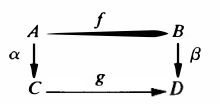
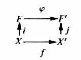
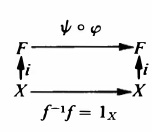

# 群与范畴

- **范畴论**：一种研究数学结构及其关系的抽象理论，核心思想是：不看对象内部，只看对象之间的关系（箭头 / 态射），从而统一描述不同数学领域的共同规律
- **背景**：
  - 拓扑中的嵌入、代数中的同态都表示我们"只关心数学对象的特定结构，不关心它具体是什么"。这是从具体空间到抽象结构的"第一层抽象"
  - 拓扑中的商拓扑、代数中的商群都拥有相同的万有性质，也就是说可以用更抽象的理论将它们统一起来，这就是从抽象结构到特征性质的"第二层抽象"

## 简单的范畴论

- **真类**：不满足ZFC公理体系的集合
  - **实例**：
    - 全体集合构成的类
    - 全体群、全体拓扑空间、全体模构成的类
    - 全体基数构成的类
- **类映射**：真类之间元素的对应关系
  - 由于不在ZFC体系内，它的性质极差

### 范畴公理

- **态射**：数学对象之间满足范畴公理的对应关系
- **态射类**：对象 $A,B$ 之间全体态射组成的集类 $\Hom(A,B)$
- **范畴**：满足范畴公理的真类和态射构成的系统 $\mc C = \ddkh{\Ob(\mc C)，\Hom(\mc C),\circ,\id}$
- **范畴公理**：设 $\Ob(\mc C)$ 是集类，$\Hom(\mc C)$ 是态射类，$\circ$ 是态射复合运算，$\id$ 是恒等态射族。若满足以下性质，则它们构成的系统 $\mc C$ 称为范畴
  - 范畴的公理化定义
  - **态射复合封闭性**：对任意 $f\in \Hom(A,B),g\in \Hom(B,C)$，存在唯一的 $g\circ f\in \Hom(A,C)$
    - 即直积运算 $\Hom(A,B)\times \Hom(B,C) = \Hom(A,C)$
  - **态射类不相交性**：若 $\Hom(A,B)\cap \Hom(A',B')\neq \varnothing$，则 $\begin{cases} A = A' \\ B = B' \end{cases}$
  - **态射结合律**：$(fg)h = f(gh)$
  - **恒等态射存在性**：对任意对象 $A$，存在唯一的 $1_A\in \hom(A,A)$，使得 $\forall f\in\hom(A,B)$，$f1_A = f = 1_Bf$

### 范畴实例

<!-- - **范畴**：（具有态射和复合态射）的（对象）的真类，若满足态射结合律、态射类不相交性、恒等态射存在性，则称为范畴
  - **态射**：$f: A\to B$
    - **态射类**：$\hom(A,B)$
    - **定义域**：$A$
    - **陪域**：$B$
  - **复合态射**：$fg: A\to C$ -->
- **等价**：
  - 设态射 $f:A\to B，g:B\to C$
  - 若存在逆态射 $g:B\to A$ 使得 $fg = 1_A$，则称对象 $A,B$ 等价
  - 易得逆态射具有唯一性，$gf = 1_B$
- **实例**：
  - **集合范畴**：对象类是全体集合，态射就是映射，等价是双射
  - **群范畴**：对象类是全体群，态射是同态，等价是同构
  - **单对象群范畴**：对象只有一个群 $G$，态射是自同态，等价是自同构
  - **群元素范畴**：对象是群 $G$ 中的元素，态射是群作用（平移），等价是
  - **箭头范畴**：对象类是范畴 $\mc C$ 中的全体态射 $\mc F$，态射 $\Hom(f,g)$ 是 $\mc C$ 中所有中间态射 $\{\a,\b^{-1}\}$ 的集合
    - $\a g\b^{-1} = f$，故 $g = \a^{-1}f\b$。**交换图**如下：
    $\\$ 
  - **拓扑空间范畴**：对象是全体拓扑空间，态射是连续映射，等价是同胚

### 子范畴

- **子范畴**：
  - 设 $\mc D,\mc C$ 是范畴
  - 若
    - **对象包含**：$\Ob(\mc D)\subset \Ob(\mc C)$
    - **态射类包含**：$\forall A,B\in \mc D，\Hom_{\mc D}(A,B) \subset \Hom_{\mc C}(A,B)$
    - **复合运算、恒等态射都相等**
  - 则 $\mc D$ 称为 $\mc C$ 的子范畴
- **偏序定理**：链范畴是偏序集范畴的子范畴
  - **证明**：
    - **偏序集范畴**：对象是偏序集，态射是保序映射（序同态），等价是保序双射（序同构）
    - **链范畴**：对象是自然数，态射是序关系
- **满子范畴**：对象是子集，态射类继承
  - **实例**：
    - （交换群范畴）是（群范畴）的满子范畴
    - （紧拓扑空间范畴）是（拓扑空间范畴）的满子范畴
- **非满子范畴**：对象是全集，态射类是子类
  - **实例**：
    - （态射是同胚的拓扑空间范畴）是（拓扑空间范畴）的子范畴

### 积

- **对象族的积**：
  - 对于范畴 $\mathcal{C}$ 中的对象族 $\{A_i\mid i\in I\}$ 和任意对象 $B$
  - 若对象 $P$ 满足
    - 存在态射 $\pi_i:P\to A_i$ 
    - 存在唯一态射 $\varphi:B\to P$，使得 $\forall i\in I，(\pi_i\varphi = \varphi_i): B\to A_i$
  - 则称 $P = \prod\limits_{i\in I}A_i$ 是 $\{A_i\}$ 的积
  - 实际上这就是拓扑中积空间的特征定理
  - **实例**：
    - 集合范畴中的笛卡尔积
      - $P = A_{i_1}\times A_{i_2}\times ... = (a_1,a_2,...)$ 是总空间
      - $B$ 是任意维度的子集
      - $\pi_i: \prod A\to A_i$
        - 投影映射
      - $\Big(\varphi = \prod\limits_{i\in I}\{\pi_i^{-1}\varphi_i\}\Big) : B\to\prod A$
        - 逆投影映射（高维映射）（向量值映射）
      - $\varphi_i : B\to A_i，b_i\mapsto a_i$
        - 高维映射的坐标分量
      - 可以看看拓扑的[Urysohn度量化定理](../拓扑学/点集拓扑/第4章下：度量化与扩张性.md)证明
    - 群范畴的直积
      - $P = G$ 是原始群，$A_i$ 为其弱内直积因子 $N_i$
      - $B$ 是任意群
      - $\pi_i: G\to N_i，g\mapsto\begin{cases} 0 & g\notin N_i \\ g & g\in N_i \end{cases}$
        - 限制映射
      - $\p:H\to G，h\mapsto g$
        - 某个群到原始群的同态
      - $(\p_i=\pi_i\p):H\to N_i$
        - 同态映射 $\p$ 到各个因子的嵌入
      - 若觉得不好理解，可以看看后面的[小总结](#小总结)
- **积唯一性**：若 $(P,\{\pi_i\})$，$(Q,\{\psi_i\})$ 都是同一个对象族的积，则它们等价
  - **证明**：
    - 即证 $f:P\to Q$ 和 $g:Q\to P$ 互逆
    - 易得 $(\psi_i fg = \psi_i): P\to A_i$
    - 再由恒等态射定义，$fg = 1_Q$。同理 $gf = 1_P$，从而等价

### 余积

- **对象族的余积**：
  - 若对象 $S$ 满足
    - 存在态射 $\tau_i: A_i\to S$
    - 存在唯一态射 $\psi: S\to B$，使得 $\forall i\in I，(\psi\tau_i = \psi_i): A_i\to B$
  - 则称 $S = \coprod\limits_{i\in I} A_i$ 是 $\{A_i\}$ 的余积
  - 实际上这就是拓扑中不交并空间（余积空间）的特征定理
  - **实例**：
    - 拓扑空间范畴的不交并
      - $A_i$ 为 $X_i$ 的开集，$\tau_i$ 是逆投影映射，$\psi$ 是基到开集的映射
      - $S$ 是 $A_i$ 生成的积拓扑基，$B$ 是积空间开集
      - $\psi_i: A_i\to B，a_i\mapsto b_i$
        - 低维开集到高维开集的映射
    - 阿贝尔群范畴的直和
      - $A_i$ 为 $Z$，$S$ 为[自由阿贝尔群](./4.阿贝尔群的结构.md)，$B$ 为任意阿贝尔群
      - $\tau_i$ 是规范逆投影，$\psi$ 为表出同态
      - $\psi_i: \lang  a_i \rang\to \bigm\lang \bigcup \lang a_i \rang \bigm\rang，a_i \mapsto (0,\cdots,0,a_i,0,\cdots)$
        - 将（自由阿贝尔群 $S$ 中同态对应 $B$ 中某元素循环子群 $\lang b_i \rang$ 的 $A_i$）同态嵌入到 $B$ 中
    - 群范畴的直积
      - $A_i$ 为一些交集只有幺元的群 $N_i$（否则积不是直积）
      - $S$ 为这些群的（弱内）直积 $G = \prod N_i$
      - $B$ 是某个群 $H$
      - $\tau_i: N_i\to \Big(\prod N_i = G\Big)$
        - 因子嵌入到直积中（规范逆投影）
      - $\psi:G\to H$
        - $G$ 到某个群 $H$ 的同态
      - $(\psi_i=\psi\tau_i):N_i\to H$
        - 同态映射在各个因子上的限制
        - 若 $N_i = G/\ker\psi$，则 $\psi$ 为规范同态
      - 详细证明过程在后面的[弱内直积定理](#弱内直积)
  - **本质**：范畴中，积与余积都是直积关系的描述，只不过前者是限制，后者是嵌入，方向相反而已。
- **余积唯一性**
  - **证明**：由于 $A_i$ 给定，当然唯一

### 小总结

- $B$ 是泛对象/余泛对象，$P$ 和 $S$ 是自由对象
  - 泛对象和余泛对象可被自由对象的唯一态射表出（前者是起点，后者是终点）
  - 自由对象：要么可分解为积，要么可分解为余积
  - 等到[阿贝尔群分解](./4.阿贝尔群的结构.md)章节会更加明朗

### 具体范畴和抽象范畴

- **底层集合 $\sigma(A)$**：态射在其上退化为函数的集合
  - **实例**：
    - 集合范畴中，底层集合是集合对象本身，底层映射是集合映射
    - 群范畴中，底层集合是群对象的元素集合，底层映射是群元素集合映射（可以不是同态）
    - 拓扑空间范畴中，底层集合是点集，底层映射是点集间映射（可以不是连续映射）
- **底层映射**：
  - 任何态射 $f:A\to B$ 都是相应底层集合的某个函数 $f:\sigma(A)\to\sigma(B)$
  - 恒等态射 $1_A$ 是底层集合恒等函数 $I_{\sigma(A)}$
  - 复合态射 $fg$ 是相应复合函数 $f\circ g$
- **具体范畴**：对于范畴 $\mathcal{C}$，存在映射 $\sigma$ 将其对象 $A$ 映成其底层集合 $\sigma(A)$
  - 每个对象都存在底层集合
  - **实例**：
    - 群范畴
    - 阿贝尔群范畴
    - 单对象群范畴
    - 拓扑空间范畴
- **抽象范畴**：不是具体范畴的范畴
  - 对象只是抽象记号，无集合结构
  - **实例**：
    - 单偏序集范畴：对象是元素而不是集合，元素上不能定义映射
      - （不能把对象看作单点集，否则原有的态射将失去意义）
    - 群元素范畴：同上
    - 同伦范畴：对象是拓扑空间，
    - 范畴的范畴：对象是范畴而不是集合，范畴上不能定义映射

### 泛对象和余泛对象
- **泛对象（始对象） $I$**：对范畴 $\mathcal{C}$ 中任意对象 $C$，均存在唯一态射 $I\to C$
- **余泛对象（终对象）$T$**：对范畴 $\mathcal{C}$ 中任意对象 $C$，均存在唯一态射 $C\to T$
- **泛对象唯一性**：范畴中任意两个泛对象等价
  - **证明**：同上
  - **实例**：
    - 平凡群是群范畴的 $I$ 和 $T$
    - 投影模和单射模是模范畴的 $I$ 和 $T$
    - 张量积是中线映射范畴的 $I$

### 自由对象

- **自由对象（由基生成的对象）**：
  - 对于具体范畴 $\mathcal{C}$ 中的非空集合 $X$
  - 若对象 $F\in\mc C$ 满足
    - 存在态射 $i:X\to F$
    - 对任意态射 $f:X\to A$，存在唯一态射 $\bar{f}:F\to A$，使得 $\forall i\in I，\bar{f}i = f %\\ (A \in \mc C)$
  - 则称对象 $F$ 在集合 $X$ 上自由
  - **理解**：关系和余积类似
    - $X$ 是基，$F$ 是基生成的对象，$A$ 是某个高维集合
    - $i$ 是基集合的包含映射，$\bar{f}$ 是基生成某个高维集合，$f$ 是基映成高维集合
    - 由于高维基一般有多种选取方式，且完全由 $X$ 生成，故低维集合 $X$ 也可看作高维基 $F$ 的基
  - **本质**：将（低维集合到高维集合的一般映射）化为（使用基处理的标准方法）
    - 自由的意思是，$F$ 完全由 $X$ 生成，不受任何其它约束，从而是范畴中由 $X$ 生成的集合里基数最大的
  - **推论**：定义域为 $F$ 的态射仅依赖于 $i(X)$ 的像部分
    - **证明**：由 $\bar{f}$ 唯一性易得
    - **理解**：将问题用基标准化后，就可以只通过基的性质来分析问题了
  - **实例（群范畴的自由群）**：
    - 群范畴中，态射是同态映射
      - $X = \{1\}$
      - 初始元 $f: X\to G，1\mapsto g$
        - 本质是将加法元素 $1$ 映射为以原根 $g$ 为底的幂元素 $1$
      - 恒等嵌入 $i:X\to \Z，1\mapsto 1$
        - 整数加法群的基只有幺元一个
      - 幂运算 $\bar{f}: \Z\to G，n\mapsto g^n$
        - 幂映射将加法基 $1$ 映射为以 $g$ 为底的幂基 $1$
    - 则 $\Z$ 在 $X$ 上自由，若想确定任何 $\Z\to G$，只需考虑1的像即可
      - 也即，每个涉及到整数加法群的同态映射，只需考虑加法基 $1$ 的像，即可通过相应同态得到所有元素的像
    - **本质**：整数加法群的基
  - **实例（阿贝尔群范畴中的自由阿贝尔群）**：（见后面[阿贝尔群的结构](./4.阿贝尔群的结构.md)）
    - 任取阿贝尔群 $A$，设其生成元系为 $\{g_i\}^k_{i=1}$
      - 此时即可设 $X = \{x_i\}^k_{i=1}$ 是自由阿贝尔群 $F$ 的基
    - 任取 $\sum\limits^k_{i=1} n_ix_i\in F$
      - $i$ 是基的嵌入映射
      - $\bar f:F\to A，\sum\limits^k_{i=1} n_ix_i \mapsto \sum\limits^k_{i=1} n_ig_i$
      - $f:X\to A，\{x_k\}\mapsto \{g_k\}$
    - **本质**：由后面结论可知，任意两个自由阿贝尔群的基均等势（维度相等），故已知 $X$ 时，可构造以 $X$ 为基的阿贝尔群 $F$ 做高维基，然后表出任意阿贝尔群 $A$
  - **实例（模/线性空间中的自由模/自然基）**
    - 任取向量空间 $V^n$，则其生成元系（基）为 $\{a_i\}^n_{i=1}$
      - 此时即可设 $X = \{e_i\}^n_{i=1}$ 是向量空间 $F^n$ 的基（向量空间均是自由对象）
    - 
  - **实例（诱导拓扑的特征性）**：
    - $i$ 是（子空间拓扑的包含映射）/（积拓扑的规范逆投影）/（商拓扑的嵌入映射）
    - $f$ 是嵌入映射
    - $\ol f$ 是嵌入映射在像集上的的限制
  - **反例**：
    - 有理数加法群 $(\Q,+)$ 不存在同态 $Q\to S_3$，从而不自由
- **自由对象等价定理**：
  - 具体范畴 $\mathcal{C}$ 中
  - 若 $F$ 在 $X$ 上自由，$F'$ 在 $X'$ 上自由，且 $|X| = |X'|$
  - 则 $F$ 和 $F'$ 等价
  - 若基存在一一对应，则生成的自由对象等价
  - **证明**：
    - 基数相同的集合存在双射，即存在 $f:X\to X'$
    - 由自由对象的性质，双射可延拓为态射 $\p:F(X)\to F(X')$
    - 同理，逆双射可延拓为逆态射 $\psi:F(X')\to F(X)$
    

### 习题

#### 范畴与态射

- **指向集**：$(S,x)$（S是集合，x是其中某元素）
  - **态射**：$(f,x,x')$，其中 $f:S\to S'，x\mapsto x'$
  - **指向集范畴 $\mc S_*$**：
    - **态射结合律**：映射结合律
    - **态射类不相交性**：$\hom(S,S')$ 就是其中的所有映射。由映射定义，只要像与原像中有一个不相等，则映射不相等
    - **恒等态射**：恒等映射
- **逆唯一性**：若 $f:A\to B$ 是范畴 $\mc C$ 上的等价，则满足 $gf = 1_A，fg = 1_B$ 的态射 $g$ 唯一
  - **证明**：

#### 积与余积

- **群范畴中的积**：群范畴 $\mc G$ 中，群 $G_1\times G_2$ 和态射（同态）$\begin{cases} \pi_1:G_1\times G_2\to G_1 \\ \pi_2:G_1\times G_2\to G_2 \end{cases}$ 构成直积
- **阿贝尔群范畴中的积**
- **集合余积存在性**：集合范畴中，任何指标集族 $\{A_i\mid i\in I\}$ 均含有余积
  - **证明**：使用不交并即可
    - **不交并**：$\bigsqcup A_i = \set{(a,i)\in (\cup A_i\times I)\mid a\in A_i}$
    - 映射 $A_i\to \bigsqcup A_i，a\mapsto (a,i)$
- **指向集积/余积存在性**
  - **楔积**：指向集的余积

#### 自由对象

- **具体单射**
  - 设 $F$ 是具体范畴 $\mc C$ 中，集合 $X$ 上的的自由对象
  - 若 $\mc C$ 存在基数不小于 $2$ 的底层集合
  - 则高维基映射 $i:X\to F$ 是单射
  - **证明**：

