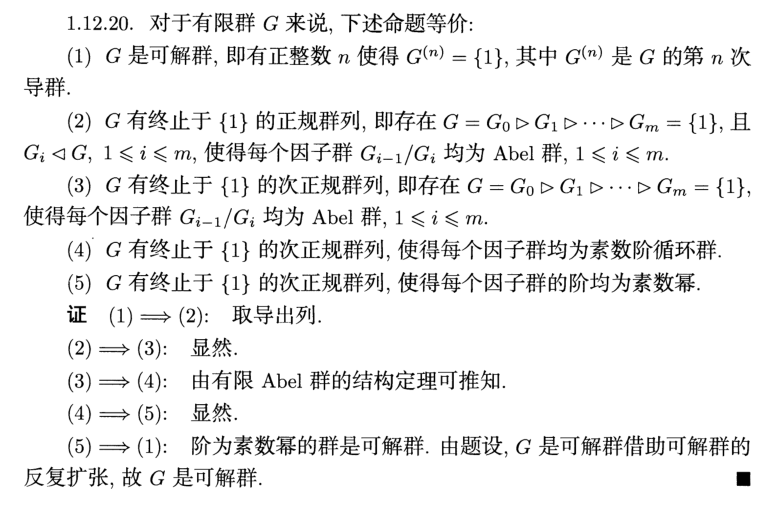

## 群列

### 群列分类

- **次正规列**：$G = G_0 \rhd G_1 \rhd \cdots G_n$
  - **列因子**：$G_i/G_{i+1}$
  - **长度**：真包含的数量 或 恒等列因子的数量
- **正规列**：$\forall G_i\lhd G$ 的次正规列
  - **实例**：
    - 导群列均为正规列
    - 幂零群的升中心列是正规列
- **单步细化**：在次正规列中添加一项 $G_{i}\rhd H\rhd G_{i+1}$
  - **细化**：添加了一些单步细化后的次正规列
  - **真细化**：使次正规列长度增加的细化
- **合成列**：$G_n = \lang e \rang$，且（每个列因子 $G_i/G_{i+1}$ 均为单群）的次正规列
  - **理解**：$G_{i+1}$ 是 $G_i$ 的最大正规子群
  - **性质**
    - **最细性（唯一性）**
    - **存在性**
- **可解列**：$G_n = \lang e \rang$，且（每个列因子 $G_i/G_{i+1}$ 均为阿贝尔群）的次正规列
  - **理解**：$G_{i}$ 的不可交换元素均在 $G_{i+1}$ 中
  - **性质**：
    - **细化封闭性**
  - **实例**：
    - 可解群的导群列
    - 幂零群的升中心列

### 群列关系

- **（定理8.4）群列关系**
  - **合成列存在性**：有限群均含有合成列
    - **证明**：可设 $G_1$ 是最大正规子群，则 $G/G_1$ 是单群
      - 再设 $G_2$ 是 $G_1$ 的最大正规子群，则 $G_1/G_2$ 是单群
      - 依次进行，则必定存在 $G_n = \lang e \rang$。此时 $G\rhd G_1\rhd \cdots G_n$ 就是合成列
  - **可解列细化封闭性**：可解列的细化还是可解列
    - **证明**：设 $G_{i}\rhd H \rhd G_{i+1}$，则 $H/G_{i+1}\lhd G_{i}/G_{i+1}$，从而也是阿贝尔群
      - 由第三同构定理，$G_i/H = (G_i/G_{i+1})/(H/G_{i+1})$，易得也是阿贝尔群
    - **理解**：可解列中，$G$ 必定是可解群，而细化添加的群也必然是 $G$ 的正规子群
  - **合成列最细性**：次正规列 $S$ 是合成列 $\LR S$ 没有真细化
    - **证明**：由正规性的商群传递性，细化必然满足 $H/G_{i+1}\lhd G_i/G_{i+1}$，由定义即可得结论
    - **本质**：合成列最细性
- **（定理8.5）可解列可解判定**：$G$ 是可解群 $\LR G$ 含有可解列
  - **证明**：
    - **必要性**：取导群列即可
    - **充分性**：由 $G/G_1$ 是阿贝尔群，得只能是 $G'\lhd G_1$。同理可得 $G_1'\lhd G_2$，再由导群单调性即得 $G^{(2)}\lhd G_2$。归纳可得 $G^{(i)}\lhd G_i$
      - 由可解列中 $G_n = \lang e \rang$ 即得可解性
  - **实例**：
    - 二面体群存在可解列 $D_n\rhd \lang a \rang \rhd \lang e \rang$，其中 $D_n/\lang a \rang = \lang b \rang \cong Z_2$
    - 若 $|G| = pq$，由柯西阶定理，存在 $|a|=p$，从而 $G \rhd \lang a \rang\rhd \lang e \rang$ 是可解列
- **（命题8.6）合成列可解判定**：有限群 $G$ 是可解群 $\LR G$ 含有列因子均为（素数阶循环群）的合成列
  - **证明**：
    - **充分性**：$G/G_1\cong Z_p$ 是阿贝尔群，从而该合成列是可解列，从而 $G$ 可解
    - **必要性**：
      - 若 $G_0\neq G_1$，设 $H_1$ 是包含 $G_1$ 的 $G$ 中最大正规子群
      - 若 $H_1\neq G_1$，设 $H_2$ 是包含 $G_1$ 的 $H_1$ 中最大正规子群
      - ……
      - 则细化 $G\rhd H_1 \rhd \cdots \rhd H_k\rhd G_1$ 是合成列
        - 易得此时 $H_i/H_{i+1}$ 是单群
        - 由有限可解性，$G/G_1\cong \sum Z_{n_i}$，再由 $H_k/G_1 \lhd G/G_1$ 是单群，得只能同构于某个 $Z_{p}$，不断归纳即得 $H_i/H_{i+1}$ 都是素数阶循环群
      - 对 $G_i$ 均如上构造细化合成列即可
- **次正规列等价**：$G$ 的两个次正规列的非平凡因子存在一一对应关系，使得两个因子是彼此同构的群
  - **等价性**：满足自反性、对称性、传递性
  - 总项数不一定相等，但彼此不同的 $G_i$ 数量一定相等
- **（引理8.8）合成列最细性**：设 $S$ 是群 $G$ 的合成列，则 $S$ 的细化均等价于 $S$
  - **证明**：设 $S$ 是 $G\rhd G_1\rhd \cdots \rhd G_n = \lang e \rang$
    - 已知合成列无真细化，定义易得结论
  - **本质**：用等价语言再次阐述合成列最细性
- **（引理8.9）Zassenhaus**：设 $A^*\lhd A，B^*\lhd B$ 是为 $G$ 的四个子群，则
  - $A^*(A\cap B^*) \lhd A^*(A\cap B)$
  - $B^*(A^*\cap B) \lhd B^*(A\cap B)$
  - $A^*(A\cap B)/A^*(A\cap B^*) \cong B^*(A\cap B) / B^*(A^*\cap B)$
  - **证明**：由正规的限制传递性，$A\cap B^*\lhd A\cap B$
    - 再由正规的乘积传递性得 $A^*(A\cap B) \lhd A$
    - 设 $D = (A^*\cap B)(A\cap B^*)$，则由正规乘积传递性，$D\lhd A\cap B$
    - 若存在满同态 $f:A^*(A\cap B)\to (A\cap B)/D$ 使得 $\ker f = A^*(A\cap B^*)$，即可得到结论
      - 设 $f(ac) = Dc\quad (\forall a\in A^*，c\in A\cap B)$
      - **满射性**：反设 $ac = a_1c_1$，则 $c_1c^{-1} = a_1^{-1}a\in (A\cap B)\cap A^* = A^*\cap B < D$，从而此时 $Dc_1 = Dc$
      - **同态性**：$f(a_1c_1a_2c_2) = f(a_1a_3c_1c_2) = Dc_1c_2 = Dc_1Dc_2 = f(a_1c_1)f(a_2c_2)$
      - **核**：$ac\in\ker f \LR c\in D \LR c = a_1c_1\pad (a_1\in A^*\cap B，c_1\in A\cap B^*)$
        - 从而 等价于 $ac = (aa_1)c_1\in A^*(A\cap B)$。由任意性即得结论
- **（定理8.10）Schreier**：群 $G$ 的任意两个【次】正规列均存在等价的【次】正规细化
  - **证明**：设 $G\geq G_1\geq\cdots\geq G_n，G\geq H_1\geq\cdots\geq H_m$ 是两个正规列，$G_{n+1} = H_{m+1} = \lang e \rang$
    - 此时 $G_i = G_{i+1}(G_i\cap H_0)\geq G_{i+1}(G_i\cap H_1)\geq\cdots\geq G_{i+1}(G_i\cap H_{m+1})$ 
      - 由Zassenhaus引理，它形成一个正规列，从而是原正规列的细化
      - 设 $\begin{cases} G(i,j) = G_{i+1}(G_i\cap H_j) \\ G(i,0) = G_i \end{cases}$
      - 则 $G\geq G(0,1) \geq \cdots G(0,m)\geq G(1,0)\geq \cdots \geq G_(n,m)$ 是细化
        - 有 $(n+1)(m+1)$ 项
    - 同理，也存在 $\begin{cases} H(i,j) = H_{j+1}(H_i\cap H_j) \\ H(0,j) = H_j \end{cases}$
      - 有 $(n+1)(m+1)$ 项
    - 最后，由Zanssenhaus引理，存在下列同构关系，从而细化等价
      - $\cfrac{G(i,j)}{G(i,j+1)} = \cfrac{G_{i+1}(G_i\cap H_j)}{G_{i+1}(G_i\cap H_{j+1})} \cong \cfrac{H_{j+1}(G_i\cap H_j)}{H_{j+1}(G_{i+1}\cap H_{j})} = \cfrac{H(i,j)}{G(i+1,j)}$
- **（定理8.11）Jordan-Holder**：群 $G$ 的任意两个合成列等价
  - **证明**：已知合成列是次正规列，合成列的细化等价，合成列无真细化。从而细化均等价于自身
  - **本质**：合成列唯一性
  - **实例**：
    - $Z_n$ 的合成列均等价，故算术基本定理成立
  - **推论（唯一对应性）**：每个含有合成列的群都唯一决定一个单群列

### 习题

- **正规列阶公式**：设 $G\geq G_1\geq\cdots G_n$ 是次正规列，则 $|G| = \Big( \prod\limits^{n-1}_{i=0} |G_i/G_{i+1}| \Big)|G_n|$
  - **证明**：利用商群的阶公式，归纳即可
  - **本质**：累乘法
- **合成列逆传递条件**：若 $N\lhd G$ 是单群，$G/N$ 存在合成列，则 $G$ 存在合成列
  - **证明**：
- **合成列最长性**：群的合成列是最长的次正规列
  - **证明**：
- 阿贝尔群 $A$ 有合成列 $\LR A$ 是有限群
- **正规对应性**：设 $H\lhd G$，若 $G$ 有合成列，则 $H$ 为某个合成列的项
  - **证明**：
- 存在合成列的可解群是有限群
  - **证明**：
- **可解乘积传递性**：设 $N\lhd G,K\leq G$ 均可解，则 $NK$ 可解
  - **证明**：
  - **推论**：阶为 $p^2q$ 的群可解
    - **证明**：
- $G_0$ 是幂零群 $\LR$ 存在正规列 $G_0\rhd G_1\rhd\cdots\rhd G_n = \lang e \rang$ 满足 $\forall 1\leq i\leq n，G_i/G_{i+1} \leq C(G_0/G_{i+1})$
  - **证明**：
    - **必要性（取降中心列）**：令 $C_i(G) = G_{n-i}$ 即可
      - 由 $C_i$ 正规性 + 正规的逆遗传性，得降中心列是正规列
      - 由定义得 $C(G/G_{i+1}) = C(G/C_{n-i-1})$
        - 再由 $C_{n-i} = C(G/C_{n-i-1})\cdot C_{n-i-1}$
        - 即得 $G_i/G_{i+1}  = C_{n-i}/C_{n-i-1} = C(G/C_{n-i-i}) = C(G/G_{i+1})$
    - **充分性（说明此时为降中心列的细化即可）**：
      - 由次中心定义，$C_{i+1}/C_i = C(G_0/C_i)$
      - 易得 $G_{n-1} \leq C_1$，再结合题设可得 $G_{n-i-1}/G_{n-i} \leq C(G_0/G_{n-i}) \leq C(G_0/C_i) =  C_{i+1}/C_i$
      - 再由 $G_0 = G$，即得 $C_n = G$，从而是幂零群
    <!-- - **充分性**：对 $n$ 归纳即可
      - $n=1$ 时，$G_1 = \lang e \rang$，$G_0$ 显然幂零
      - $n=2$ 时，$G_2 = \lang e \rang$，由题设 $G_1 \leq C_1$，而次中心 $C_2/C_1 = C(G_0/C_1) \geq C(G_0/G_1)$
      - 设 $n$ 以下均成立，则由幂零群的正规逆传递性即可
        - 取 $N = G/G_1$，由题设 $N\leq C(G_k/G_{k+1})$，且 $N$ 幂零
        - $G/N = G_1$，由归纳假设幂零（？错的）
        - 综上即得 $G_{k}$ 幂零
      - 对 $i$ 归纳即可
      - 当 $i=n-1$ 时，$G_{n-1}/G_n = G_{n-1} \leq C(G/G_n) = C(G)$，由中心幂零性 + 幂零遗传性，即得 $G_{n-1}$ 幂零
      - 若 $i\geq k+1$ 时均成立，用幂零群的正规逆传递性即可
        - 取 $N = G_k/G_{k+1}$，由题设 $N\leq C(G/G_{k+1}) \leq C(G_k )$，且 $N$ 幂零
        - $G_{k}/N = G_{k+1}$ 由归纳假设幂零
        - 综上即得 $G_{k}$ 幂零 -->
 

#### 例子

##### 置换群

- $S_3\times Z_2$ 的合成列
- $S_4$
  - **合成列**：$S_4\rhd A_4 \rhd K_4 \rhd Z_2 \rhd \lang e \rang$
  - **合成因子**：$Z_2,Z_3,Z_2,Z_2$
- $A_4$
  - 合成列
- $S_n\pad (n\geq 5)$

##### 二面体群

- $D_4$ 的合成列
- $D_6$ 的合成列

##### 其它

- 四元数群 $Q_8$
  - **合成列**：
    - $Q_8 \rhd \lang a \rang \rhd \lang a^2 \rang \rhd \lang e \rang$
    - $Q_8 \rhd \lang b \rang \rhd \lang a^2 \rang \rhd \lang e \rang$
    - $Q_8 \rhd \lang ab \rang \rhd \lang a^2 \rang \rhd \lang e \rang$
- $60$ 阶单群均同构于 $A_5$
  - **证明**：
- 没有小于 $60$ 阶的非阿贝尔单群
  - **证明**：
- 设 $G\leq S_7 = \lang (12345667)，(26)(34) \rang$，则 $|G| = 168$
  - **证明**：
  - $G$ 是可迁的
  - $G_x$ 是最大的真子群
    - **群块**：子集 $T$ 满足 $\forall g\in G$，要么 $gT\cap T = \varnothing$，要么 $gT = T$
    - $G$ 的群块的阶